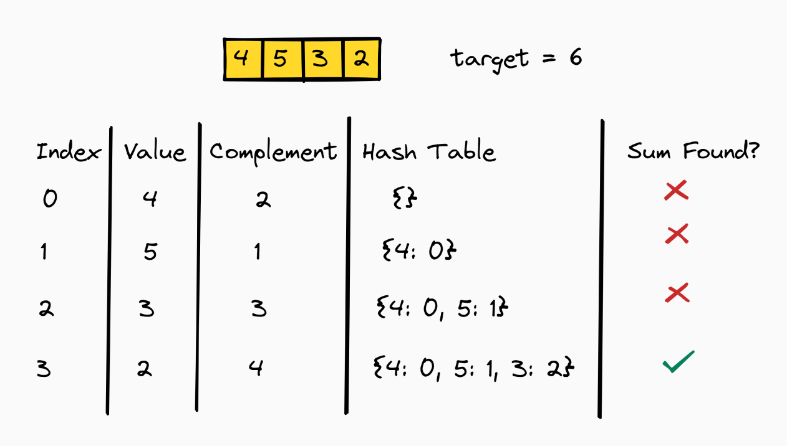

# Two Number Sum

<!-- TOC -->
* [Two Number Sum](#two-number-sum)
  * [Difficulty: 🟢 Easy](#difficulty--easy)
  * [Problem Description](#problem-description)
  * [Sample Input](#sample-input)
  * [Problem Analysis](#problem-analysis)
  * [Approach: Using a HashSet for Fast Lookup](#approach-using-a-hashset-for-fast-lookup)
  * [Java Code with Step-by-Step Explanation](#java-code-with-step-by-step-explanation)
  * [Time/Space Complexity](#timespace-complexity)
  * [Diagram](#diagram)
<!-- TOC -->

## Difficulty: 🟢 Easy

**Category**: Arrays

## Problem Description

Write a function that takes in a non-empty array of distinct integers and an integer representing a target sum. If any
two numbers in the input array sum up to the target sum, the function should return them in an array, in any order. If
no two numbers sum up to the target sum, the function should return an empty array.

**Note**:

- The target sum has to be obtained by summing two different integers in the array.
- You can't add a single integer to itself to obtain the target sum.
- You can assume that there will be at most one pair of numbers summing up to the target sum.

## Sample Input

```plaintext
array = [3, 5, -4, 8, 11, 1, -1, 6]
targetSum = 10
[-1, 11] // The numbers could be in reverse order
```

## Problem Analysis

The goal is to find two numbers in a given array that sum up to a specific target number (targetSum). If such a pair
exists, return the two numbers as an array. Otherwise, return an empty array.

**Key constraints:**

- The array contains distinct integers (no duplicates).
- Only one pair of numbers (if any) sums up to the targetSum.
- Order of numbers in the output doesn't matter.

## Approach: Using a HashSet for Fast Lookup

1. **Why a HashSet?**

- HashSet allows O(1) average time complexity for insertions and lookups.
- Instead of iterating through the array for each element (which would result in O(n²) time complexity), we can use a
  HashSet to check if the complement of the current number exists.

2. **Logic:**

- As we traverse the array, calculate the difference (complement) between the targetSum and the current number.
- Check if the complement already exists in the HashSet:
    - If yes, return the pair [complement, current number] since it satisfies the condition.
    - If no, add the current number to the HashSet for future reference.
- If no pair is found by the end of the loop, return an empty array.

## Java Code with Step-by-Step Explanation

```java
import java.util.Arrays;
import java.util.HashSet;
import java.util.Set;

class TwoNumberSumSolution {
    public static int[] twoNumberSum(int[] array, int targetSum) {
        // Step 1: Create a HashSet to store the numbers we have seen so far
        Set<Integer> nums = new HashSet<Integer>();

        // Step 2: Iterate through the array
        for (int num : array) {
            // Calculate the complement needed to reach the targetSum
            int complement = targetSum - num;

            // Step 3: Check if the complement is already in the HashSet
            if (nums.contains(complement)) {
                // If found, return the pair [complement, num]
                return new int[]{complement, num};
            } else {
                // If not found, add the current number to the HashSet
                nums.add(num);
            }
        }

        // Step 4: If no pair is found, return an empty array
        return new int[0];
    }

    // Main method to test the solution
    public static void main(String[] args) {
        int[] array = {3, 5, -4, 8, 11, 1, -1, 6}; // Input array
        int targetSum = 10; // Target sum to find

        // Call the function and store the result
        int[] result = twoNumberSum(array, targetSum);

        // Print the result
        if (result.length == 0) {
            System.out.println("No pair found.");
        } else {
            System.out.println("Pair found: " + Arrays.toString(result));
        }
    }
}

```

## Time/Space Complexity

- **Time Complexity**: **O(n)**, where n is the size of the array. We iterate over every number in the array and the
  hash table lookup/add operations take constant time.
- **Space Complexity**: **O(n)**, where n is the size of the array. Our hash map stores every number in the input array.

## Diagram

