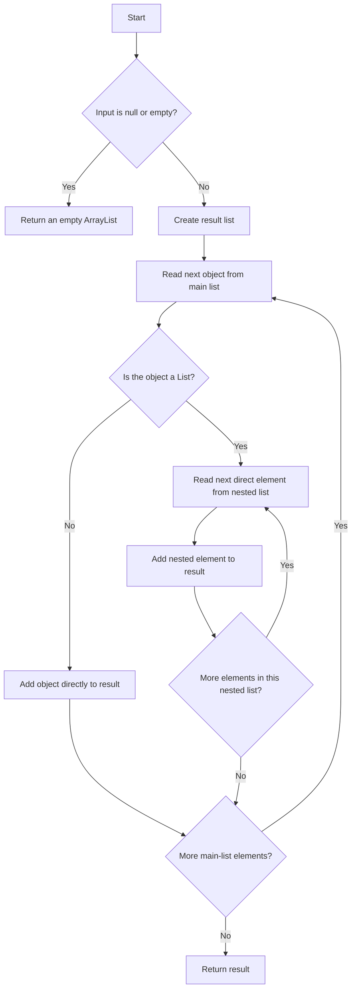

# Flatten One Level

<!-- TOC -->
* [Flatten One Level](#flatten-one-level)
  * [Difficulty: 🟢 Easy](#difficulty--easy)
  * [Category](#category)
  * [Problem Description](#problem-description)
  * [Examples](#examples)
    * [Example 1](#example-1)
    * [Example 2](#example-2)
    * [Example 3](#example-3)
    * [Example 4](#example-4)
    * [Example 5](#example-5)
  * [Important Rules](#important-rules)
  * [Problem Analysis](#problem-analysis)
  * [How to Interpret One Level](#how-to-interpret-one-level)
    * [Level 0](#level-0)
    * [Level 1](#level-1)
    * [Level 2](#level-2)
  * [Approach: Traverse and Expand Direct Sub-Lists](#approach-traverse-and-expand-direct-sub-lists)
  * [Algorithm](#algorithm)
  * [Final Java Solution](#final-java-solution)
  * [Step-by-Step Explanation](#step-by-step-explanation)
    * [Imports](#imports)
    * [Method declaration](#method-declaration)
    * [Null and empty validation](#null-and-empty-validation)
    * [Result list](#result-list)
    * [Traverse the main list](#traverse-the-main-list)
    * [Detect a nested list](#detect-a-nested-list)
    * [Expand the direct nested list](#expand-the-direct-nested-list)
    * [Add non-list elements](#add-non-list-elements)
    * [Return the result](#return-the-result)
  * [Execution Walkthrough](#execution-walkthrough)
    * [First iteration](#first-iteration)
    * [Second iteration](#second-iteration)
    * [Third iteration](#third-iteration)
  * [Why It Does Not Flatten Recursively](#why-it-does-not-flatten-recursively)
  * [Evaluation of the Final Solution](#evaluation-of-the-final-solution)
    * [Strengths](#strengths)
      * [Correct null and empty handling](#correct-null-and-empty-handling)
      * [Correct use of `List`](#correct-use-of-list)
      * [Correct type detection](#correct-type-detection)
      * [Correct one-level behavior](#correct-one-level-behavior)
      * [Preserves order](#preserves-order)
      * [Does not modify the input](#does-not-modify-the-input)
      * [Good use of generics](#good-use-of-generics)
    * [Minor considerations](#minor-considerations)
      * [Returning an empty list for null](#returning-an-empty-list-for-null)
      * [Shallow copy behavior](#shallow-copy-behavior)
  * [Alternative with addAll](#alternative-with-addall)
  * [Correctness Explanation](#correctness-explanation)
    * [Case 1: The element is not a list](#case-1-the-element-is-not-a-list)
    * [Case 2: The element is a list](#case-2-the-element-is-a-list)
  * [Time and Space Complexity](#time-and-space-complexity)
    * [Time Complexity](#time-complexity)
    * [Auxiliary Space Complexity](#auxiliary-space-complexity)
    * [Output Space Complexity](#output-space-complexity)
  * [Edge Cases](#edge-cases)
    * [Null input](#null-input)
    * [Empty input](#empty-input)
    * [No nested lists](#no-nested-lists)
    * [Empty nested list](#empty-nested-list)
    * [Multiple nested lists](#multiple-nested-lists)
    * [Deeper nesting](#deeper-nesting)
    * [Mixed object types](#mixed-object-types)
  * [Test Cases](#test-cases)
  * [Diagram](#diagram)
<!-- TOC -->

## Difficulty: 🟢 Easy

## Category

**Arrays / Lists**

## Problem Description

Given a list that may contain regular elements or nested lists, return a new list with exactly **one level of nesting
removed**.

Only the lists that appear directly inside the main input list must be expanded.

If one of those nested lists contains another list, that deeper list must remain unchanged as an element in the result.

The expected method signature is:

```java
public List<Object> flattenOneLevel(List<Object> array)
```

The solution must be implemented manually without using methods such as:

```java
stream()

flatMap()
```

## Examples

### Example 1

```java
flattenOneLevel(
        List.of(
                1,
        List.of(2, 3),
        List.

of(4,5)
    )
            );
```

Result:

```java
[1,2,3,4,5]
```

### Example 2

```java
flattenOneLevel(
        List.of(
                1,
        List.of(2, List.of(3, 4)),
        5
        )
        );
```

Result:

```java
[1,2,[3,4],5]
```

The nested list `[3, 4]` remains unchanged because it is deeper than the first nested level.

### Example 3

```java
flattenOneLevel(
        List.of(
                List.of(1, 2),
        List.

of(3,4)
    )
            );
```

Result:

```java
[1,2,3,4]
```

### Example 4

```java
flattenOneLevel(List.of());
```

Result:

```java
[]
```

### Example 5

```java
flattenOneLevel(List.of(1, 2,3));
```

Result:

```java
[1,2,3]
```

## Important Rules

1. Flatten only one level.
2. Do not recursively flatten deeper nested lists.
3. Preserve the original order of all elements.
4. Return a new list.
5. If the input list is empty, return an empty list.
6. The submitted implementation also returns an empty list when the input is `null`.
7. Elements that are not lists must be copied directly to the result.
8. Elements inside a direct nested list must be copied individually to the result.

## Problem Analysis

The main difficulty is understanding the difference between:

- Flattening one level.
- Flattening all levels recursively.

Consider:

```java
[1,[2,[3,4]],5]
```

The main list contains three elements:

```text
1
[2, [3, 4]]
5
```

The second element is a direct nested list, so its immediate elements must be expanded:

```text
2
[3, 4]
```

However, `[3, 4]` is nested inside another nested list. It is not directly inside the main list, so it must remain
unchanged.

Correct result:

```java
[1,2,[3,4],5]
```

Incorrect recursive result:

```java
[1,2,3,4,5]
```

The algorithm therefore needs to inspect the elements of the main list and make one decision for each element:

```text
Is the current element a List?
```

- If no, add it directly.
- If yes, add each of its immediate elements.
- Do not repeat the same process recursively on those inner elements.

## How to Interpret One Level

It helps to visualize the nesting depth.

Input:

```java
[
        1,
        [2,[3,4]],
        5
        ]
```

### Level 0

The main list:

```java
[1,[2,[3,4]],5]
```

### Level 1

The direct nested list:

```java
[2,[3,4]]
```

This level must be flattened.

### Level 2

The deeper nested list:

```java
[3,4]
```

This level must not be flattened.

After removing only level 1:

```java
[1,2,[3,4],5]
```

## Approach: Traverse and Expand Direct Sub-Lists

Use a new `ArrayList<Object>` to store the result.

Traverse every element in the input list.

For each element:

```java
if(obj instanceof
List<?> nestedList)
```

Java checks whether the current object is some kind of `List`.

If it is a list, iterate over that list and copy each direct element into the result.

If it is not a list, copy the object directly.

This preserves the original order while removing exactly one level of nesting.

## Algorithm

1. Check whether the input list is `null` or empty.
    - Return a new empty `ArrayList`.
2. Create an empty result list.
3. Iterate through each object in the input list.
4. For each object:
    - If it is a `List<?>`, iterate through its direct elements.
    - Add each direct nested element to the result.
    - Otherwise, add the object directly to the result.
5. Return the result list.

Pseudocode:

```text
function flattenOneLevel(array):

    if array is null or empty:
        return empty list

    result = empty list

    for each object in array:

        if object is a list:
            for each nestedObject in object:
                add nestedObject to result
        else:
            add object to result

    return result
```

## Final Java Solution

```java
import java.util.List;
import java.util.ArrayList;

public class Solution {
    public List<Object> flattenOneLevel(List<Object> array) {

        if (array == null || array.isEmpty()) {
            return new ArrayList<>();
        }

        List<Object> result = new ArrayList<>();

        for (Object obj : array) {
            if (obj instanceof List<?> nestedList) {
                for (Object nestedObject : nestedList) {
                    result.add(nestedObject);
                }
            } else {
                result.add(obj);
            }
        }

        return result;
    }
}
```

## Step-by-Step Explanation

### Imports

```java
import java.util.List;
import java.util.ArrayList;
```

`List` is used as the interface type for the input and return value.

`ArrayList` is used as the concrete mutable implementation for the result.

### Method declaration

```java
public List<Object> flattenOneLevel(List<Object> array)
```

The method receives a list whose elements are typed as `Object`.

This allows the list to contain different types:

```java
List.of(
    1,
            "Java",
            true,
    List.of(2, 3)
)
```

The result is also a `List<Object>` because flattened elements may have different types.

### Null and empty validation

```java
if(array ==null||array.

isEmpty()){
        return new ArrayList<>();
        }
```

The condition uses `||`. Java evaluates it from left to right.

If `array == null` is `true`, Java does not evaluate `array.isEmpty()`. This prevents a `NullPointerException`.

The method returns a new mutable empty list.

### Result list

```java
List<Object> result = new ArrayList<>();
```

The result must be separate from the input because the problem asks for a new flattened list.

### Traverse the main list

```java
for(Object obj :array)
```

Each element may be a number, string, Boolean, list, or another object.

### Detect a nested list

```java
if(obj instanceof
List<?> nestedList)
```

This uses Java pattern matching for `instanceof`.

It performs two actions:

1. Checks whether `obj` is a `List`.
2. Creates a local variable called `nestedList`.

The wildcard `List<?>` means a list containing elements of an unknown type.

### Expand the direct nested list

```java
for(Object nestedObject :nestedList){
        result.

add(nestedObject);
}
```

Each immediate element of the nested list is added separately.

The algorithm does not inspect `nestedObject` again with another `instanceof` check. That is why it flattens only one
level.

### Add non-list elements

```java
else{
        result.add(obj);
}
```

If the current object is not a list, it is copied directly to the result.

### Return the result

```java
return result;
```

The original input list remains unchanged.

## Execution Walkthrough

Consider this input:

```java
List<Object> input = List.of(
        1,
        List.of(2, List.of(3, 4)),
        5
);
```

Initial result:

```java
[]
```

### First iteration

Current object:

```java
1
```

It is not a list.

Result:

```java
[1]
```

### Second iteration

Current object:

```java
[2,[3,4]]
```

It is a list, so the inner loop processes its direct elements.

First direct element:

```java
2
```

Result:

```java
[1,2]
```

Second direct element:

```java
[3,4]
```

It is added as an object without being flattened further.

Result:

```java
[1,2,[3,4]]
```

### Third iteration

Current object:

```java
5
```

It is not a list.

Final result:

```java
[1,2,[3,4],5]
```

## Why It Does Not Flatten Recursively

A recursive flattening algorithm would process nested lists by calling itself again.

Conceptually, it would contain logic similar to:

```java
flattenOneLevel(nestedList);
```

Your solution does not do that.

Instead, it only executes:

```java
result.add(nestedObject);
```

This means that even if `nestedObject` is another list, it is added directly as one element.

For example, if:

```java
nestedObject =List.

of(3,4);
```

then the result receives:

```java
[3,4]
```

without opening it again.

## Evaluation of the Final Solution

Your final solution is correct for the problem.

### Strengths

#### Correct null and empty handling

```java
if(array ==null||array.

isEmpty())
```

The use of `||` avoids evaluating `isEmpty()` when `array` is `null`.

#### Correct use of `List`

A Java `List` uses:

```java
isEmpty()

size()
```

not `length()`.

#### Correct type detection

```java
obj instanceof
List<?> nestedList
```

This correctly identifies direct nested lists.

#### Correct one-level behavior

The nested loop adds only the direct contents of each first-level sub-list. It does not recurse.

#### Preserves order

Input:

```java
[1,[2,3],4]
```

Output:

```java
[1,2,3,4]
```

#### Does not modify the input

All values are copied into a new `ArrayList`.

#### Good use of generics

Using `List<?>` avoids an unsafe cast to `List<Object>`.

### Minor considerations

#### Returning an empty list for null

Your method treats `null` and `[]` as equivalent inputs.

That is acceptable for this challenge, but in production code the expected behavior should be documented.

Other possible contracts include returning `null` or rejecting a null value with `Objects.requireNonNull`.

#### Shallow copy behavior

The method creates a new outer list, but it does not clone the objects inside it.

If a deeper nested list is preserved, the result contains a reference to the same nested list object. That is normal and
appropriate for this challenge.

## Alternative with addAll

The inner loop:

```java
for(Object nestedObject :nestedList){
        result.

add(nestedObject);
}
```

can be replaced by:

```java
result.addAll(nestedList);
```

Alternative solution:

```java
import java.util.ArrayList;
import java.util.List;

public class Solution {
    public List<Object> flattenOneLevel(List<Object> array) {
        if (array == null || array.isEmpty()) {
            return new ArrayList<>();
        }

        List<Object> result = new ArrayList<>();

        for (Object obj : array) {
            if (obj instanceof List<?> nestedList) {
                result.addAll(nestedList);
            } else {
                result.add(obj);
            }
        }

        return result;
    }
}
```

Both versions have the same asymptotic complexity.

The explicit nested loop is better for learning because it clearly shows how each direct element is copied.

The `addAll` version is shorter and idiomatic for production code.

## Correctness Explanation

Consider each element in the main input list.

### Case 1: The element is not a list

The required result must contain that element unchanged.

The algorithm executes:

```java
result.add(obj);
```

Therefore, the element is handled correctly.

### Case 2: The element is a list

The problem requires removing exactly this direct list boundary.

The algorithm iterates through its immediate elements and adds each one:

```java
for(Object nestedObject :nestedList){
        result.

add(nestedObject);
}
```

It does not recursively process those inner elements.

Therefore:

- The direct list boundary is removed.
- Deeper list boundaries are preserved.
- The original order is maintained.

Because every main-list element is handled according to one of these two cases, the returned list is exactly the input
flattened by one level.

## Time and Space Complexity

Let:

```text
n = number of elements in the main list
m = total number of elements inside all direct nested lists
k = number of elements in the returned list
```

### Time Complexity

```text
O(n + m)
```

The outer loop examines every main-list element once.

The inner loops examine every element inside every direct nested list once.

If `N` represents the total number of processed elements, the complexity can also be written as:

```text
O(N)
```

### Auxiliary Space Complexity

Excluding the returned list:

```text
O(1)
```

The algorithm uses only loop variables and object references.

### Output Space Complexity

The result list contains `k` elements:

```text
O(k)
```

Since the problem requires returning a new list, this output space is unavoidable.

## Edge Cases

### Null input

```java
flattenOneLevel(null);
```

Result:

```java
[]
```

### Empty input

```java
flattenOneLevel(List.of());
```

Result:

```java
[]
```

### No nested lists

```java
flattenOneLevel(List.of(1, 2,3));
```

Result:

```java
[1,2,3]
```

### Empty nested list

```java
flattenOneLevel(
        List.of(
                1,
        List.of(),
        2
                )
                );
```

Result:

```java
[1,2]
```

### Multiple nested lists

```java
flattenOneLevel(
        List.of(
                List.of(1, 2),
        List.

of(3,4)
    )
            );
```

Result:

```java
[1,2,3,4]
```

### Deeper nesting

```java
flattenOneLevel(
        List.of(
                List.of(
                List.of(1, 2)
        )
                )
                );
```

Result:

```java
[[1,2]]
```

Only the outer nested list is removed.

### Mixed object types

```java
flattenOneLevel(
        List.of(
                "Java",
        List.of(25, true),
        3.14
                )
                );
```

Result:

```java
["Java",25,true,3.14]
```

## Test Cases

```java
import java.util.List;

public class Main {
    public static void main(String[] args) {
        Solution solution = new Solution();

        System.out.println(
                solution.flattenOneLevel(
                        List.of(
                                1,
                                List.of(2, 3),
                                List.of(4, 5)
                        )
                )
        );
        // [1, 2, 3, 4, 5]

        System.out.println(
                solution.flattenOneLevel(
                        List.of(
                                1,
                                List.of(2, List.of(3, 4)),
                                5
                        )
                )
        );
        // [1, 2, [3, 4], 5]

        System.out.println(
                solution.flattenOneLevel(
                        List.of(
                                List.of(1, 2),
                                List.of(3, 4)
                        )
                )
        );
        // [1, 2, 3, 4]

        System.out.println(
                solution.flattenOneLevel(List.of())
        );
        // []

        System.out.println(
                solution.flattenOneLevel(List.of(1, 2, 3))
        );
        // [1, 2, 3]

        System.out.println(
                solution.flattenOneLevel(
                        List.of(
                                1,
                                List.of(),
                                2
                        )
                )
        );
        // [1, 2]

        System.out.println(
                solution.flattenOneLevel(
                        List.of(
                                List.of(
                                        List.of(1, 2)
                                )
                        )
                )
        );
        // [[1, 2]]

        System.out.println(
                solution.flattenOneLevel(null)
        );
        // []
    }
}
```

## Diagram

