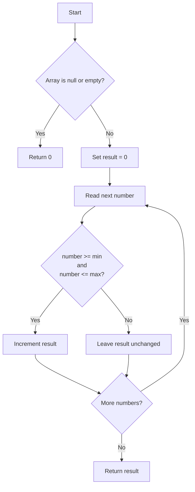

# Count Elements in an Inclusive Range

<!-- TOC -->

* [Count Elements in an Inclusive Range](#count-elements-in-an-inclusive-range)
    * [Difficulty: 🟢 Easy](#difficulty--easy)
    * [Category](#category)
    * [Problem Description](#problem-description)
    * [Examples](#examples)
        * [Example 1](#example-1)
        * [Example 2](#example-2)
        * [Example 3](#example-3)
        * [Example 4: Inclusive boundaries](#example-4-inclusive-boundaries)
    * [Problem Analysis](#problem-analysis)
    * [Evaluation of the Original Code](#evaluation-of-the-original-code)
        * [1. Arrays use `length`, not `length()`](#1-arrays-use-length-not-length)
        * [2. The range is inclusive](#2-the-range-is-inclusive)
    * [Approach: Linear Scan](#approach-linear-scan)
    * [Algorithm](#algorithm)
    * [Corrected Java Solution](#corrected-java-solution)
    * [Step-by-Step Explanation](#step-by-step-explanation)
        * [Input validation](#input-validation)
        * [Counter initialization](#counter-initialization)
        * [Array traversal](#array-traversal)
        * [Inclusive comparison](#inclusive-comparison)
        * [Increment the result](#increment-the-result)
    * [Execution Walkthrough](#execution-walkthrough)
    * [Correctness Explanation](#correctness-explanation)
        * [Case 1: The number is inside the range](#case-1-the-number-is-inside-the-range)
        * [Case 2: The number is outside the range](#case-2-the-number-is-outside-the-range)
    * [Time and Space Complexity](#time-and-space-complexity)
        * [Time Complexity](#time-complexity)
        * [Space Complexity](#space-complexity)
    * [Alternative Enhanced `for` Loop](#alternative-enhanced-for-loop)
    * [Test Cases](#test-cases)
    * [Diagram](#diagram)

<!-- TOC -->

## Difficulty: 🟢 Easy

## Category

**Arrays**

## Problem Description

Given an array of integers and two integer values, `min` and `max`, return the number of elements that are inside the
inclusive range:

```text
[min, max]
```

An inclusive range includes both boundary values. A number must therefore be counted when:

```java
number >=min &&number <=max
```

The expected method signature is:

```java
public int contarEnRango(int[] numbers, int min, int max)
```

## Examples

### Example 1

```java
contarEnRango(
    new int[] {
    1, 5, 3, 8, 2, 7
},
        2,
        6
        );
```

Values inside `[2, 6]`:

```text
5, 3, 2
```

Result:

```java
3
```

### Example 2

```java
contarEnRango(
    new int[] {
    10, 20, 30
},
        15,
        25
        );
```

Result:

```java
1
```

### Example 3

```java
contarEnRango(new int[] {
},1,10);
```

Result:

```java
0
```

### Example 4: Inclusive boundaries

```java
contarEnRango(
    new int[] {
    2, 3, 6, 7
},
        2,
        6
        );
```

The values `2`, `3`, and `6` are counted.

Result:

```java
3
```

## Problem Analysis

The method does not return the matching values. It only counts how many elements satisfy:

```text
min <= current number <= max
```

Java does not allow chained comparisons like this:

```java
min <=number <=max
```

The comparison must be written as two boolean expressions joined with `&&`:

```java
number >=min &&number <=max
```

For example, with:

```text
min = 2
max = 6
number = 5
```

The checks are:

```text
5 >= 2 -> true
5 <= 6 -> true
```

Because both conditions are true, `5` must be counted.

## Evaluation of the Original Code

The code from the screenshot was approximately:

```java
public class Solution {
    public int contarEnRango(int[] numbers, int min, int max) {

        if (numbers == null || numbers.length() == 0) {
            return 0;
        }

        int result = 0;

        for (int i = 0; i < numbers.length(); i++) {
            if (min < numbers[i] && numbers[i] < max) {
                result++;
            }
        }

        return result;
    }
}
```

The general strategy is correct:

1. Validate the array.
2. Initialize a counter.
3. Traverse every value.
4. Increment the counter when a value is in range.
5. Return the counter.

However, two details must be corrected.

### 1. Arrays use `length`, not `length()`

For a Java array, `length` is a field:

```java
numbers.length
```

Incorrect:

```java
numbers.length()
```

Correct:

```java
numbers.length
```

A useful distinction is:

```text
Array       -> length
String      -> length()
Collection  -> size()
```

Examples:

```java
int[] values = {1, 2, 3};
values.length;

String text = "Java";
text.

length();

List<Integer> list = List.of(1, 2, 3);
list.

size();
```

### 2. The range is inclusive

The original condition was:

```java
min<numbers[i]&&numbers[i] <max
```

This excludes values equal to `min` and `max`.

For the range `[2, 6]`, both `2` and `6` must be counted.

The correct condition is:

```java
numbers[i]>=min &&numbers[i]<=max
```

## Approach: Linear Scan

The optimal approach for an unsorted array is to inspect each element once.

For every number:

1. Check whether it is greater than or equal to `min`.
2. Check whether it is less than or equal to `max`.
3. Increment the counter when both conditions are true.

No sorting, nested loops, or additional data structures are required.

## Algorithm

1. If `numbers` is `null` or empty, return `0`.
2. Initialize a counter with `0`.
3. Traverse the array from index `0` to `numbers.length - 1`.
4. For each value, verify:

```java
numbers[i]>=min &&numbers[i]<=max
```

5. Increment the counter when the condition is true.
6. Return the final counter.

Pseudocode:

```text
function countInRange(numbers, min, max):

    if numbers is null or empty:
        return 0

    count = 0

    for every number in numbers:
        if number >= min and number <= max:
            count = count + 1

    return count
```

## Corrected Java Solution

```java
public class Solution {

    public int contarEnRango(int[] numbers, int min, int max) {

        if (numbers == null || numbers.length == 0) {
            return 0;
        }

        int result = 0;

        for (int i = 0; i < numbers.length; i++) {
            if (numbers[i] >= min && numbers[i] <= max) {
                result++;
            }
        }

        return result;
    }
}
```

## Step-by-Step Explanation

### Input validation

```java
if(numbers ==null||numbers.length ==0){
        return 0;
        }
```

There are no elements to count when the array is `null` or empty.

The use of `||` is important. Java evaluates the condition from left to right. If `numbers == null` is true, Java does
not evaluate `numbers.length`, preventing a `NullPointerException`.

### Counter initialization

```java
int result = 0;
```

No matching elements have been found yet, so the counter starts at zero.

### Array traversal

```java
for(int i = 0;
i<numbers.length;i++)
```

The loop visits every valid index:

```text
0, 1, 2, ..., numbers.length - 1
```

The condition uses `<`, not `<=`, because `numbers.length` is not a valid index.

### Inclusive comparison

```java
if(numbers[i]>=min &&numbers[i]<=max)
```

Both boundaries are included because the comparisons use `>=` and `<=`.

### Increment the result

```java
result++;
```

This is equivalent to:

```java
result =result +1;
```

## Execution Walkthrough

Input:

```java
numbers =new int[]{1,5,3,8,2,7};
min =2;
max =6;
```

Initial state:

```text
result = 0
```

| Number | In `[2, 6]`? | Result |
|-------:|:------------:|-------:|
|    `1` |      No      |    `0` |
|    `5` |     Yes      |    `1` |
|    `3` |     Yes      |    `2` |
|    `8` |      No      |    `2` |
|    `2` |     Yes      |    `3` |
|    `7` |      No      |    `3` |

Final result:

```java
3
```

Notice that `2` is counted because the lower boundary is inclusive.

## Correctness Explanation

For each array element, there are two cases.

### Case 1: The number is inside the range

The following condition is true:

```java
number >=min &&number <=max
```

The algorithm increments the counter exactly once, so every valid value is counted.

### Case 2: The number is outside the range

At least one of these statements is true:

```java
number<min
```

or:

```java
number >max
```

The condition is false, so the counter is not incremented.

Because every array element is examined exactly once, the final result is exactly the number of elements inside the
inclusive range.

## Time and Space Complexity

Let:

```text
n = numbers.length
```

### Time Complexity

```text
O(n)
```

Every array element is inspected once, and each comparison takes constant time.

### Space Complexity

```text
O(1)
```

The algorithm uses only the counter and loop index. No additional structure grows with the input size.

## Alternative Enhanced `for` Loop

Because the index is not required, the same algorithm can be written with an enhanced `for` loop:

```java
public class Solution {

    public int contarEnRango(int[] numbers, int min, int max) {

        if (numbers == null || numbers.length == 0) {
            return 0;
        }

        int result = 0;

        for (int number : numbers) {
            if (number >= min && number <= max) {
                result++;
            }
        }

        return result;
    }
}
```

This version is slightly easier to read. Both versions have the same complexity:

```text
Time:  O(n)
Space: O(1)
```

## Test Cases

```java
public class Main {

    public static void main(String[] args) {
        Solution solution = new Solution();

        System.out.println(
                solution.contarEnRango(
                        new int[]{1, 5, 3, 8, 2, 7},
                        2,
                        6
                )
        );
        // 3

        System.out.println(
                solution.contarEnRango(
                        new int[]{10, 20, 30},
                        15,
                        25
                )
        );
        // 1

        System.out.println(
                solution.contarEnRango(
                        new int[]{},
                        1,
                        10
                )
        );
        // 0

        System.out.println(
                solution.contarEnRango(
                        new int[]{2, 3, 6, 7},
                        2,
                        6
                )
        );
        // 3

        System.out.println(
                solution.contarEnRango(
                        new int[]{-10, -5, 0, 5},
                        -5,
                        0
                )
        );
        // 2

        System.out.println(
                solution.contarEnRango(
                        new int[]{3, 5, 5, 8},
                        5,
                        5
                )
        );
        // 2

        System.out.println(
                solution.contarEnRango(null, 1, 10)
        );
        // 0
    }
}
```

## Diagram

