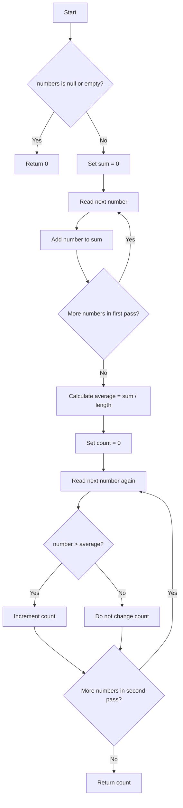

# Count Elements Above the Average

<!-- TOC -->
* [Count Elements Above the Average](#count-elements-above-the-average)
  * [Difficulty: 🟢 Easy](#difficulty--easy)
  * [Category](#category)
  * [Problem Description](#problem-description)
  * [Examples](#examples)
    * [Example 1](#example-1)
    * [Example 2](#example-2)
    * [Example 3](#example-3)
    * [Example 4](#example-4)
  * [Important Rules](#important-rules)
  * [Understanding the Problem](#understanding-the-problem)
  * [Evaluation of the Submitted Solution](#evaluation-of-the-submitted-solution)
    * [What the solution does well](#what-the-solution-does-well)
    * [Possible improvements](#possible-improvements)
  * [Approach: Two Linear Passes](#approach-two-linear-passes)
    * [First pass](#first-pass)
    * [Calculate the average](#calculate-the-average)
    * [Second pass](#second-pass)
  * [Algorithm](#algorithm)
  * [Recommended Java Solution](#recommended-java-solution)
  * [Step-by-Step Explanation](#step-by-step-explanation)
    * [Input validation](#input-validation)
    * [Sum variable](#sum-variable)
    * [First loop](#first-loop)
    * [Average calculation](#average-calculation)
    * [Counter](#counter)
    * [Second loop](#second-loop)
    * [Return](#return)
  * [Execution Walkthrough](#execution-walkthrough)
    * [First pass: calculate the sum](#first-pass-calculate-the-sum)
    * [Calculate the average](#calculate-the-average-1)
    * [Second pass: count values above the average](#second-pass-count-values-above-the-average)
  * [Why Two Passes Are Needed](#why-two-passes-are-needed)
  * [Correctness Explanation](#correctness-explanation)
    * [Phase 1: Correct average](#phase-1-correct-average)
    * [Phase 2: Correct count](#phase-2-correct-count)
  * [Time and Space Complexity](#time-and-space-complexity)
    * [Time Complexity](#time-complexity)
    * [Space Complexity](#space-complexity)
  * [Edge Cases](#edge-cases)
    * [Null array](#null-array)
    * [Empty array](#empty-array)
    * [One element](#one-element)
    * [All elements are equal](#all-elements-are-equal)
    * [Negative values](#negative-values)
    * [Decimal values](#decimal-values)
    * [Values equal to the average](#values-equal-to-the-average)
  * [Test Cases](#test-cases)
  * [Diagram](#diagram)
<!-- TOC -->

## Difficulty: 🟢 Easy

## Category

**Arrays**

## Problem Description

Given an array of numbers, return the number of elements that are **strictly greater** than the arithmetic average of
the array.

The arithmetic average is calculated as:

```text
average = sum of all elements / number of elements
```

The expected method signature is:

```java
public int countAboveAverage(double[] numbers)
```

If the array is empty, return:

```java
0
```

The submitted solution also returns `0` when the input array is `null`.

## Examples

### Example 1

```java
countAboveAverage(
    new double[] {
    1, 2, 3, 4, 5
}
);
```

Average:

```text
(1 + 2 + 3 + 4 + 5) / 5 = 3.0
```

Elements strictly greater than `3.0`:

```text
4, 5
```

Result:

```java
2
```

### Example 2

```java
countAboveAverage(
    new double[] {
    10, 10, 10
}
);
```

Average:

```text
30 / 3 = 10.0
```

No element is strictly greater than `10.0`.

Result:

```java
0
```

### Example 3

```java
countAboveAverage(new double[] {
});
```

Result:

```java
0
```

### Example 4

```java
countAboveAverage(
    new double[] {
    -5, -2, -1
}
);
```

Average:

```text
(-5 + -2 + -1) / 3 = -2.666...
```

Elements strictly greater than the average:

```text
-2, -1
```

Result:

```java
2
```

## Important Rules

1. Calculate the arithmetic average of the complete array.

2. Count only values that are strictly greater than the average.

```java
number >average
```

3. Values equal to the average must not be counted.

4. If the array is empty, return `0`.

5. Negative and decimal values are valid.

6. The original array must not be modified.

## Understanding the Problem

The problem has two separate tasks:

1. Calculate the average.
2. Count how many values are above that average.

For example:

```java
numbers ={1,2,3,4,5}
```

First calculate the sum:

```text
1 + 2 + 3 + 4 + 5 = 15
```

Then calculate the average:

```text
15 / 5 = 3.0
```

Finally, compare each number with `3.0`:

```text
1 > 3.0 -> false
2 > 3.0 -> false
3 > 3.0 -> false
4 > 3.0 -> true
5 > 3.0 -> true
```

The answer is:

```java
2
```

The comparison must use:

```java
>
```

not:

```java
>=
```

because the statement asks for values that are strictly greater than the average.

## Evaluation of the Submitted Solution

The code shown in the screenshot is approximately:

```java
public class Solution {

    public int countAboveAverage(double[] numbers) {
        if (numbers == null || numbers.length == 0) {
            return 0;
        }

        double sum = 0;
        double items = numbers.length;
        double average = 0;
        int result = 0;

        for (double num : numbers) {
            sum += num;
        }

        avarage = sum / items;

        for (double num : numbers) {
            if (num > avarage) {
                result++;
            }
        }

        return result;
    }
}
```

### What the solution does well

The submitted solution uses the correct overall strategy.

It correctly validates a `null` or empty array:

```java
if(numbers ==null||numbers.length ==0){
        return 0;
        }
```

It correctly calculates the sum:

```java
for(double num :numbers){
sum +=num;
}
```

It correctly calculates the average:

```java
average =sum /numbers.length;
```

It also correctly uses a strict comparison:

```java
if(num >average)
```

This ensures that values equal to the average are not counted.

The solution has optimal asymptotic complexity:

```text
Time:  O(n)
Space: O(1)
```

### Possible improvements

## Approach: Two Linear Passes

The most direct and memory-efficient solution uses two passes through the array.

### First pass

Calculate the total sum:

```java
sum +=number;
```

### Calculate the average

```java
double average = sum / numbers.length;
```

### Second pass

Count every number that satisfies:

```java
number >average
```

This approach does not require another array, list, set, or map.

## Algorithm

1. If `numbers` is `null` or empty, return `0`.

2. Initialize:

```java
double sum = 0.0;
```

3. Traverse the array and add every number to `sum`.

4. Calculate:

```java
double average = sum / numbers.length;
```

5. Initialize:

```java
int count = 0;
```

6. Traverse the array again.

7. For every number strictly greater than `average`, increment `count`.

8. Return `count`.

Pseudocode:

```text
function countAboveAverage(numbers):

    if numbers is null or empty:
        return 0

    sum = 0

    for each number in numbers:
        sum = sum + number

    average = sum / length of numbers
    count = 0

    for each number in numbers:
        if number is greater than average:
            count = count + 1

    return count
```

## Recommended Java Solution

```java
public class Solution {

    public int countAboveAverage(double[] numbers) {
        if (numbers == null || numbers.length == 0) {
            return 0;
        }

        double sum = 0.0;

        for (double number : numbers) {
            sum += number;
        }

        double average = sum / numbers.length;
        int count = 0;

        for (double number : numbers) {
            if (number > average) {
                count++;
            }
        }

        return count;
    }
}
```

## Step-by-Step Explanation

### Input validation

```java
if(numbers ==null||numbers.length ==0){
        return 0;
        }
```

An average cannot be calculated for an empty array because division by zero would be required.

Returning early prevents that problem.

The `||` operator is also null-safe because Java evaluates it from left to right.

When:

```java
numbers ==null
```

is true, Java does not evaluate:

```java
numbers.length
```

### Sum variable

```java
double sum = 0.0;
```

The sum is a `double` because the array may contain decimal values.

### First loop

```java
for(double number :numbers){
sum +=number;
}
```

The enhanced `for` loop reads every value in the array.

This statement:

```java
sum +=number;
```

is equivalent to:

```java
sum =sum +number;
```

### Average calculation

```java
double average = sum / numbers.length;
```

`sum` is a `double`, so Java performs floating-point division.

For example:

```java
sum =10.0;
numbers.length =4;
```

Result:

```java
average =2.5;
```

### Counter

```java
int count = 0;
```

The answer is a whole number because it represents a quantity of elements.

### Second loop

```java
for(double number :numbers){
        if(number >average){
count++;
        }
        }
```

Every element is compared against the final average.

Only strictly greater values increment the counter.

### Return

```java
return count;
```

After the second pass, `count` contains the required result.

## Execution Walkthrough

Consider:

```java
numbers ={1,2,3,4,5}
```

### First pass: calculate the sum

Initial value:

```text
sum = 0.0
```

| Number | Updated sum |
|-------:|------------:|
|      1 |         1.0 |
|      2 |         3.0 |
|      3 |         6.0 |
|      4 |        10.0 |
|      5 |        15.0 |

Final sum:

```text
15.0
```

### Calculate the average

```text
average = 15.0 / 5
average = 3.0
```

### Second pass: count values above the average

Initial value:

```text
count = 0
```

| Number | Comparison        | Count |
|-------:|:------------------|------:|
|      1 | `1 > 3.0` → false |     0 |
|      2 | `2 > 3.0` → false |     0 |
|      3 | `3 > 3.0` → false |     0 |
|      4 | `4 > 3.0` → true  |     1 |
|      5 | `5 > 3.0` → true  |     2 |

Final result:

```java
2
```

## Why Two Passes Are Needed

The final average is not known until every value has contributed to the sum.

Consider:

```java
{1,2,100}
```

While reading `1`, the algorithm does not yet know that the final average will be:

```text
103 / 3 = 34.333...
```

Therefore, it cannot correctly decide whether `1` is above the final average until the entire array has been processed.

There are two general possibilities:

1. Store values while calculating the average.
2. Traverse the existing array again.

Because the input array is already available, a second pass is simpler and uses constant extra memory.

Two passes still produce linear complexity:

```text
O(n) + O(n) = O(n)
```

## Correctness Explanation

The algorithm is correct because it completes two necessary phases.

### Phase 1: Correct average

The first loop adds every element exactly once.

Therefore:

```java
sum
```

equals the total of all array values.

Dividing by:

```java
numbers.length
```

produces the arithmetic average of the complete array.

### Phase 2: Correct count

The second loop examines every element exactly once.

For each element:

- If `number > average`, the algorithm increments `count`.
- If `number <= average`, the algorithm does not increment `count`.

Therefore:

- Every value strictly above the average is counted.
- No value equal to or below the average is counted.

After all elements are processed, `count` is exactly the number of values strictly greater than the average.

## Time and Space Complexity

Let:

```text
n = numbers.length
```

### Time Complexity

The first loop processes `n` elements:

```text
O(n)
```

The second loop also processes `n` elements:

```text
O(n)
```

Combined:

```text
O(n) + O(n) = O(2n) = O(n)
```

Big-O notation ignores constant factors, so the final complexity is:

```text
O(n)
```

### Space Complexity

```text
O(1)
```

The algorithm uses only a fixed number of variables:

```java
double sum;
double average;
int count;
```

No additional structure grows with the size of the input.

## Edge Cases

### Null array

```java
countAboveAverage(null);
```

Result:

```java
0
```

### Empty array

```java
countAboveAverage(new double[] {
});
```

Result:

```java
0
```

### One element

```java
countAboveAverage(new double[] {
    5
});
```

Average:

```text
5.0
```

The only value is equal to the average, not greater.

Result:

```java
0
```

### All elements are equal

```java
countAboveAverage(
    new double[] {
    10, 10, 10
}
);
```

Result:

```java
0
```

### Negative values

```java
countAboveAverage(
    new double[] {
    -5, -2, -1
}
);
```

Average:

```text
-2.666...
```

Result:

```java
2
```

### Decimal values

```java
countAboveAverage(
    new double[] {
    1.5, 2.5, 3.5
}
);
```

Average:

```text
2.5
```

Only `3.5` is strictly greater.

Result:

```java
1
```

### Values equal to the average

```java
countAboveAverage(
    new double[] {
    1, 2, 3
}
);
```

Average:

```text
2.0
```

The value `2` is not counted.

Result:

```java
1
```

## Test Cases

```java
public class Main {

    public static void main(String[] args) {
        Solution solution = new Solution();

        System.out.println(
                solution.countAboveAverage(
                        new double[]{1, 2, 3, 4, 5}
                )
        );
        // 2

        System.out.println(
                solution.countAboveAverage(
                        new double[]{10, 10, 10}
                )
        );
        // 0

        System.out.println(
                solution.countAboveAverage(
                        new double[]{}
                )
        );
        // 0

        System.out.println(
                solution.countAboveAverage(
                        new double[]{-5, -2, -1}
                )
        );
        // 2

        System.out.println(
                solution.countAboveAverage(
                        new double[]{1.5, 2.5, 3.5}
                )
        );
        // 1

        System.out.println(
                solution.countAboveAverage(
                        new double[]{5}
                )
        );
        // 0

        System.out.println(
                solution.countAboveAverage(null)
        );
        // 0
    }
}
```

## Diagram

