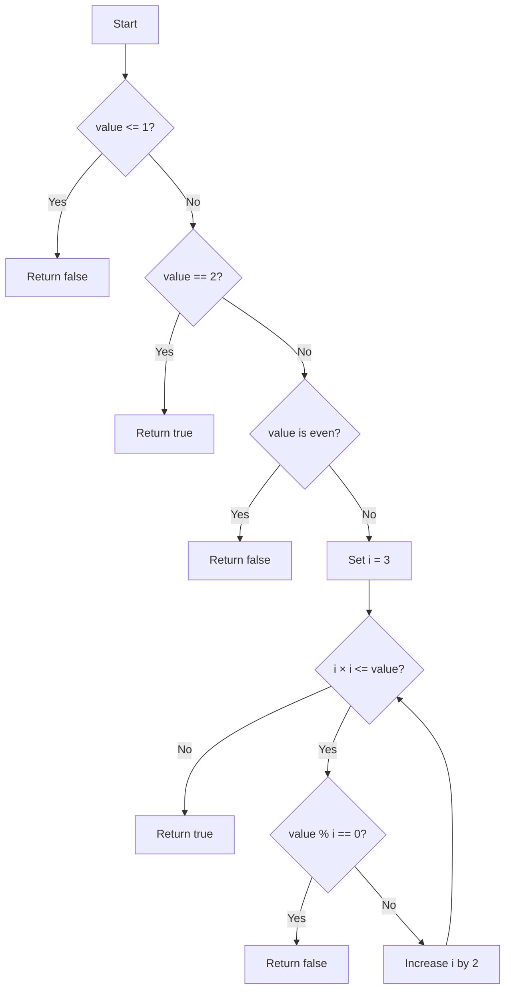

# Prime Number Check

The implementation is in [IsPrime.java](IsPrime.java), including executable assertion-based unit tests in its
`main` method.

<!-- TOC -->
* [Prime Number Check](#prime-number-check)
  * [Difficulty: 🟢 Easy](#difficulty--easy)
  * [Category](#category)
  * [Problem Description](#problem-description)
  * [Examples](#examples)
  * [Important Rules](#important-rules)
  * [Understanding Prime Numbers](#understanding-prime-numbers)
  * [Evaluation of the Submitted Solution](#evaluation-of-the-submitted-solution)
  * [Approach: Test Divisors Only Up to the Square Root](#approach-test-divisors-only-up-to-the-square-root)
  * [Why We Only Check Up to the Square Root](#why-we-only-check-up-to-the-square-root)
  * [Why We Skip Even Numbers](#why-we-skip-even-numbers)
  * [Algorithm](#algorithm)
  * [Original Java Solution](#original-java-solution)
  * [Recommended Safer Java Solution](#recommended-safer-java-solution)
  * [Detailed Explanation of the `for` Loop](#detailed-explanation-of-the-for-loop)
    * [1. Initialization](#1-initialization)
    * [2. Condition](#2-condition)
    * [3. Update](#3-update)
  * [Execution Walkthrough](#execution-walkthrough)
    * [Iteration 1](#iteration-1)
    * [Iteration 2](#iteration-2)
  * [Correctness Explanation](#correctness-explanation)
  * [Time and Space Complexity](#time-and-space-complexity)
    * [Time Complexity](#time-complexity)
    * [Space Complexity](#space-complexity)
  * [Edge Cases](#edge-cases)
  * [Test Cases](#test-cases)
  * [Diagram](#diagram)
<!-- TOC -->

## Difficulty: 🟢 Easy

## Category

**Math / Number Theory**

## Problem Description

Given an integer, determine whether it is a prime number.

A prime number is an integer greater than `1` that has exactly two positive divisors:

```text
1
and
the number itself
```

The expected method signature is:

```java
public boolean isPrime(int value)
```

The method returns `true` when `value` is prime and `false` otherwise.

## Examples

```java
isPrime(2);   // true
isPrime(3);   // true
isPrime(5);   // true
isPrime(7);   // true

isPrime(1);   // false
isPrime(4);   // false
isPrime(9);   // false
isPrime(15);  // false
```

## Important Rules

- Numbers less than or equal to `1` are not prime.
- `2` is prime and is the only even prime number.
- Every even number greater than `2` is not prime.
- For an odd number, it is enough to test possible divisors up to its square root.

## Understanding Prime Numbers

Prime numbers can only be divided exactly by `1` and themselves.

Examples:

```text
2, 3, 5, 7, 11, 13, 17, 19
```

Composite numbers have additional divisors:

```text
4  = 2 × 2
9  = 3 × 3
15 = 3 × 5
21 = 3 × 7
```

## Evaluation of the Submitted Solution

The submitted solution is:

```java
public class IsPrime {
    public boolean isPrime(int value) {
        if (value <= 1) return false;
        if (value == 2) return true;
        if (value % 2 == 0) return false;

        for (int i = 3; (long) i * i <= value; i += 2) {
            if (value % i == 0) {
                return false;
            }
        }

        return true;
    }
}
```

The algorithm is correct and efficient.

It handles the important special cases first:

```java
if (value <= 1) return false;
if (value == 2) return true;
if (value % 2 == 0) return false;
```

Then it checks only odd possible divisors:

```java
3, 5, 7, 9, 11, ...
```

and stops once `i` is greater than the square root of `value`.

The only technical improvement is that:

```java
i * i
```

can theoretically overflow an `int` for sufficiently large values of `i`.

A safer condition is:

```java
(long) i * i <= value
```

or:

```java
i <= value / i
```

## Approach: Test Divisors Only Up to the Square Root

A brute-force approach could check every possible divisor from `2` to `value - 1`.

That works, but it performs many unnecessary checks.

The key observation is:

> If a number has a divisor greater than its square root, it must also have a paired divisor smaller than its square root.

Therefore, if no divisor exists up to `√value`, then the number is prime.

## Why We Only Check Up to the Square Root

Consider:

```text
36
```

Its factor pairs are:

```text
1 × 36
2 × 18
3 × 12
4 × 9
6 × 6
```

After `6 × 6`, the same pairs repeat in reverse order:

```text
9 × 4
12 × 3
18 × 2
36 × 1
```

Since:

```text
√36 = 6
```

we only need to test divisors up to `6`.

Another example:

```text
91 = 7 × 13
```

The square root of `91` is approximately:

```text
9.53
```

Even though `13` is greater than the square root, its paired divisor `7` is smaller.

So checking up to the square root is sufficient.

## Why We Skip Even Numbers

After this check:

```java
if (value % 2 == 0) {
    return false;
}
```

the remaining candidate must be odd.

Therefore, testing even divisors such as:

```text
4, 6, 8, 10, 12
```

would be unnecessary.

The loop starts at `3` and increments by `2`:

```java
i += 2;
```

producing:

```text
3, 5, 7, 9, 11, 13, ...
```

## Algorithm

1. If `value <= 1`, return `false`.
2. If `value == 2`, return `true`.
3. If `value` is even, return `false`.
4. Start testing odd divisors at `3`.
5. Continue while `i² <= value`.
6. If `value % i == 0`, return `false`.
7. Increase `i` by `2`.
8. If no divisor is found, return `true`.

Pseudocode:

```text
function isPrime(value):

    if value <= 1:
        return false

    if value == 2:
        return true

    if value is divisible by 2:
        return false

    divisor = 3

    while divisor * divisor <= value:

        if value is divisible by divisor:
            return false

        divisor = divisor + 2

    return true
```

## Original Java Solution

```java
public class IsPrime {
    public boolean isPrime(int value) {
        if (value <= 1) return false;
        if (value == 2) return true;
        if (value % 2 == 0) return false;

        for (int i = 3; (long) i * i <= value; i += 2) {
            if (value % i == 0) {
                return false;
            }
        }

        return true;
    }
}
```

## Recommended Safer Java Solution

```java
public class IsPrime {
    public boolean isPrime(int value) {
        if (value <= 1) {
            return false;
        }

        if (value == 2) {
            return true;
        }

        if (value % 2 == 0) {
            return false;
        }

        for (int i = 3; (long) i * i <= value; i += 2) {
            if (value % i == 0) {
                return false;
            }
        }

        return true;
    }
}
```

The cast:

```java
(long) i
```

makes the multiplication happen using `long`, preventing integer overflow in the loop condition.

## Detailed Explanation of the `for` Loop

The key line is:

```java
for (int i = 3; (long) i * i <= value; i += 2)
```

A Java `for` loop has three parts:

```java
for (initialization; condition; update)
```

### 1. Initialization

```java
int i = 3;
```

`i` represents a possible divisor.

We start at `3` because:

- `1` divides every number and does not help determine primality.
- `2` was already checked.
- `3` is the next possible divisor.

### 2. Condition

```java
(long) i * i <= value
```

This means:

```text
i² <= value
```

which is equivalent to:

```text
i <= √value
```

For `49`:

```text
i = 3 -> 9  <= 49 -> continue
i = 5 -> 25 <= 49 -> continue
i = 7 -> 49 <= 49 -> continue
i = 9 -> 81 <= 49 -> stop
```

The `<=` is important because `49 = 7 × 7`.

If the condition used only `<`, then `7` would not be checked.

### 3. Update

```java
i += 2;
```

This is equivalent to:

```java
i = i + 2;
```

Starting from `3`, the values are:

```text
3, 5, 7, 9, 11, 13, ...
```

Only odd divisors are tested.

## Execution Walkthrough

Consider:

```java
isPrime(29);
```

Initial checks:

```text
29 <= 1      -> false
29 == 2      -> false
29 % 2 == 0  -> false
```

The loop begins.

### Iteration 1

```text
i = 3
3 × 3 <= 29 -> true
29 % 3 = 2
```

No divisor found.

Update:

```text
i = 5
```

### Iteration 2

```text
5 × 5 <= 29 -> true
29 % 5 = 4
```

No divisor found.

Update:

```text
i = 7
```

Next condition:

```text
7 × 7 <= 29
49 <= 29 -> false
```

The loop ends.

Since no divisor was found:

```java
return true;
```

So:

```java
isPrime(29); // true
```

Now consider:

```java
isPrime(45);
```

The first divisor tested is `3`:

```text
45 % 3 == 0
```

Therefore:

```java
return false;
```

The method stops immediately because finding one valid divisor is enough to prove the number is not prime.

## Correctness Explanation

The algorithm handles every possible case:

- Values `<= 1` are rejected.
- `2` is accepted.
- All even values greater than `2` are rejected.
- For odd values, every relevant odd divisor up to the square root is checked.

If one divisor is found, the number is composite.

If no divisor is found up to the square root, then no larger divisor can exist without a smaller paired divisor also existing below the square root.

Therefore, the number is prime.

## Time and Space Complexity

Let:

```text
n = value
```

### Time Complexity

The loop checks divisors only up to:

```text
√n
```

and skips all even divisors.

Therefore:

```text
O(√n)
```

### Space Complexity

The algorithm uses only a fixed number of variables.

Therefore:

```text
O(1)
```

## Edge Cases

```java
isPrime(-7); // false
isPrime(0);  // false
isPrime(1);  // false
isPrime(2);  // true
isPrime(4);  // false
isPrime(9);  // false
isPrime(49); // false
isPrime(97); // true
```

## Test Cases

Run the in-class tests with:

```bash
javac -d out src/coding_challenges/functions/medium/_01_isPrime/IsPrime.java
java -cp out coding_challenges.functions.medium._01_isPrime.IsPrime
```

```java
public class IsPrime {

    public static void main(String[] args) {
        IsPrime solution = new IsPrime();

        System.out.println(solution.isPrime(-7)); // false
        System.out.println(solution.isPrime(0));  // false
        System.out.println(solution.isPrime(1));  // false
        System.out.println(solution.isPrime(2));  // true
        System.out.println(solution.isPrime(3));  // true
        System.out.println(solution.isPrime(4));  // false
        System.out.println(solution.isPrime(9));  // false
        System.out.println(solution.isPrime(21)); // false
        System.out.println(solution.isPrime(29)); // true
        System.out.println(solution.isPrime(49)); // false
        System.out.println(solution.isPrime(97)); // true
    }
}
```

## Diagram


