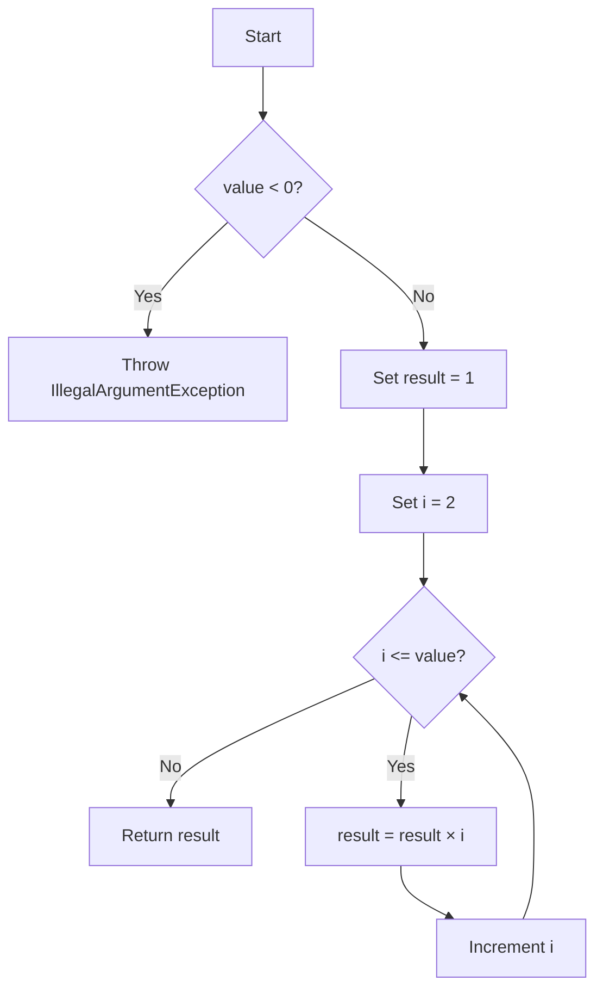

# Factorial

The implementation is in [Factorial.java](Factorial.java), including executable assertion-based unit tests in its
`main` method.

<!-- TOC -->
* [Factorial](#factorial)
  * [Difficulty: 🟢 Easy](#difficulty--easy)
  * [Category](#category)
  * [Problem Description](#problem-description)
  * [Examples](#examples)
  * [Important Rules](#important-rules)
  * [Understanding Factorial](#understanding-factorial)
  * [Evaluation of the Final Approach](#evaluation-of-the-final-approach)
    * [1. Reject negative numbers](#1-reject-negative-numbers)
    * [2. Start the loop at `2`](#2-start-the-loop-at-2)
    * [3. Use `long` for the result](#3-use-long-for-the-result)
  * [Approach: Iterative Multiplication](#approach-iterative-multiplication)
  * [Algorithm](#algorithm)
  * [Recommended Java Solution Using `long`](#recommended-java-solution-using-long)
  * [Step-by-Step Explanation](#step-by-step-explanation)
    * [Method declaration](#method-declaration)
    * [Negative input validation](#negative-input-validation)
    * [Result initialization](#result-initialization)
    * [Loop](#loop)
    * [Return value](#return-value)
  * [Why the Accumulator Starts at `1`](#why-the-accumulator-starts-at-1)
  * [Why the Loop Starts at `2`](#why-the-loop-starts-at-2)
  * [Execution Walkthrough](#execution-walkthrough)
    * [Iteration 1](#iteration-1)
    * [Iteration 2](#iteration-2)
    * [Iteration 3](#iteration-3)
    * [Iteration 4](#iteration-4)
  * [Why `0!` and `1!` Work Without a Special Case](#why-0-and-1-work-without-a-special-case)
  * [Handling Negative Values](#handling-negative-values)
  * [Why Use `long` Instead of `int`](#why-use-long-instead-of-int)
  * [Limits of `long`](#limits-of-long)
  * [Correctness Explanation](#correctness-explanation)
  * [Time and Space Complexity](#time-and-space-complexity)
    * [Time Complexity](#time-complexity)
    * [Space Complexity](#space-complexity)
  * [Iterative vs Recursive Factorial](#iterative-vs-recursive-factorial)
    * [Iterative version](#iterative-version)
    * [Recursive version](#recursive-version)
  * [Edge Cases](#edge-cases)
    * [Zero](#zero)
    * [One](#one)
    * [Small factorial](#small-factorial)
    * [Negative input](#negative-input)
    * [Largest factorial that fits in `long`](#largest-factorial-that-fits-in-long)
    * [Overflow case](#overflow-case)
  * [Test Cases](#test-cases)
  * [Diagram](#diagram)
<!-- TOC -->

## Difficulty: 🟢 Easy

## Category

**Math / Iteration**

## Problem Description

Given a non-negative integer `value`, calculate its factorial.

The factorial of a number `n` is written as:

```text
n!
```

and is defined as:

```text
n! = n × (n - 1) × (n - 2) × ... × 2 × 1
```

Special cases:

```text
0! = 1
1! = 1
```

The method should reject negative values because factorial is not defined for negative integers in the standard integer definition.

This version uses `long` instead of `int` so it can safely represent larger factorial values.

The expected method signature is:

```java
public long factorial(int value)
```

## Examples

```java
factorial(0);  // 1
factorial(1);  // 1
factorial(2);  // 2
factorial(3);  // 6
factorial(5);  // 120
factorial(10); // 3628800
factorial(20); // 2432902008176640000
```

For a negative value:

```java
factorial(-5);
```

the method throws:

```text
IllegalArgumentException
```

## Important Rules

1. Factorial is defined for non-negative integers.

2. `0!` is equal to `1`.

3. `1!` is equal to `1`.

4. Negative integers should not produce a factorial result.

5. The method uses iterative multiplication.

6. The accumulator must start at `1`, not `0`.

7. The loop can start at `2` because multiplying by `1` does not change the result.

8. `long` supports larger factorials than `int`, but it still has a finite limit.

## Understanding Factorial

The factorial operation multiplies all positive integers from `1` up to a given number.

For example:

```text
5!
```

means:

```text
5 × 4 × 3 × 2 × 1
```

Result:

```text
120
```

The same multiplication can be performed in ascending order:

```text
1 × 2 × 3 × 4 × 5
```

The result is still:

```text
120
```

This works because multiplication is associative and commutative.

## Evaluation of the Final Approach

The original iterative idea is correct and efficient.

A cleaned-up version improves it in three important ways:

### 1. Reject negative numbers

```java
if (value < 0) {
    throw new IllegalArgumentException(
        "Factorial is not defined for negative integers"
    );
}
```

Without this validation, a negative input would incorrectly return `1` because the loop would never execute.

### 2. Start the loop at `2`

Instead of:

```java
for (int i = 1; i <= value; i++)
```

we can use:

```java
for (int i = 2; i <= value; i++)
```

Multiplying by `1` has no effect, so starting at `2` avoids one unnecessary iteration.

### 3. Use `long` for the result

Using:

```java
long result = 1L;
```

extends the valid range of factorial calculations compared with `int`.

## Approach: Iterative Multiplication

The algorithm uses an accumulator.

Start with:

```java
result = 1
```

Then multiply it by every integer from `2` to `value`.

For:

```java
value = 5
```

the process is:

```text
result = 1

result = 1 × 2 = 2
result = 2 × 3 = 6
result = 6 × 4 = 24
result = 24 × 5 = 120
```

The final result is:

```text
120
```

## Algorithm

1. If `value` is negative, throw an exception.

2. Initialize:

```java
long result = 1L;
```

3. Iterate from `2` through `value`.

4. Multiply the accumulator by the current number.

5. Return the accumulator.

Pseudocode:

```text
function factorial(value):

    if value < 0:
        throw error

    result = 1

    for i from 2 to value:
        result = result * i

    return result
```

## Recommended Java Solution Using `long`

```java
public class Factorial {

    public long factorial(int value) {

        if (value < 0) {
            throw new IllegalArgumentException(
                "Factorial is not defined for negative integers"
            );
        }

        long result = 1L;

        for (int i = 2; i <= value; i++) {
            result *= i;
        }

        return result;
    }
}
```

## Step-by-Step Explanation

### Method declaration

```java
public long factorial(int value)
```

The input is an `int` because the factorial index is expected to be a whole number.

The return type is `long` because factorial values grow very quickly.

### Negative input validation

```java
if (value < 0) {
    throw new IllegalArgumentException(
        "Factorial is not defined for negative integers"
    );
}
```

A negative integer does not have a factorial under the standard definition used in this challenge.

Throwing an exception prevents the method from silently returning an incorrect value.

### Result initialization

```java
long result = 1L;
```

The result starts at `1`.

This is essential because factorial is built through multiplication.

### Loop

```java
for (int i = 2; i <= value; i++) {
    result *= i;
}
```

The loop visits:

```text
2, 3, 4, ..., value
```

For each number:

```java
result *= i;
```

means:

```java
result = result * i;
```

### Return value

```java
return result;
```

After the loop ends, `result` contains the factorial.

## Why the Accumulator Starts at `1`

For addition, an accumulator usually starts at:

```text
0
```

because:

```text
x + 0 = x
```

For multiplication, the neutral value is:

```text
1
```

because:

```text
x × 1 = x
```

Therefore:

```java
long result = 1L;
```

is the correct starting point.

If we incorrectly used:

```java
long result = 0L;
```

then:

```text
0 × 2 = 0
0 × 3 = 0
0 × 4 = 0
```

and every factorial would incorrectly return `0`.

## Why the Loop Starts at `2`

The loop could start at `1`:

```java
for (int i = 1; i <= value; i++)
```

but the first multiplication would be:

```text
1 × 1 = 1
```

which changes nothing.

Therefore:

```java
for (int i = 2; i <= value; i++)
```

is slightly cleaner.

The sequence becomes:

```text
2, 3, 4, ..., value
```

## Execution Walkthrough

Consider:

```java
factorial(5);
```

Initial state:

```text
result = 1
```

### Iteration 1

```text
i = 2
```

Operation:

```text
result = 1 × 2
```

Result:

```text
2
```

### Iteration 2

```text
i = 3
```

Operation:

```text
result = 2 × 3
```

Result:

```text
6
```

### Iteration 3

```text
i = 4
```

Operation:

```text
result = 6 × 4
```

Result:

```text
24
```

### Iteration 4

```text
i = 5
```

Operation:

```text
result = 24 × 5
```

Result:

```text
120
```

The loop ends and the method returns:

```java
120L
```

## Why `0!` and `1!` Work Without a Special Case

A common implementation includes:

```java
if (value == 0 || value == 1) {
    return 1;
}
```

That is mathematically correct, but it is not required with this loop structure.

For:

```java
value = 0
```

the loop condition is immediately:

```text
2 <= 0
```

which is false.

The loop never executes.

Therefore:

```text
result = 1
```

is returned.

So:

```text
0! = 1
```

works naturally.

The same happens for:

```java
value = 1
```

because:

```text
2 <= 1
```

is also false.

Therefore:

```text
1! = 1
```

works naturally as well.

This is a useful algorithm-design principle:

> If the general structure already handles an edge case correctly, an additional special-case branch may not be necessary.

## Handling Negative Values

Consider:

```java
factorial(-5);
```

Without validation:

```java
long result = 1L;

for (int i = 2; i <= -5; i++)
```

The condition:

```text
2 <= -5
```

is false.

The loop would never execute and the method would incorrectly return:

```text
1
```

That is why this validation is important:

```java
if (value < 0) {
    throw new IllegalArgumentException(
        "Factorial is not defined for negative integers"
    );
}
```

## Why Use `long` Instead of `int`

Java `int` has a maximum value of:

```text
2,147,483,647
```

Factorials grow very quickly.

For example:

```text
10! =       3,628,800
11! =      39,916,800
12! =     479,001,600
13! =   6,227,020,800
```

`12!` fits inside an `int`.

`13!` does not.

Therefore, an `int` implementation is only reliable up to:

```text
12!
```

Java `long` has a much larger maximum value:

```text
9,223,372,036,854,775,807
```

This allows factorial values up to:

```text
20!
```

## Limits of `long`

Even `long` eventually overflows.

The largest factorial that fits inside a signed Java `long` is:

```text
20! = 2,432,902,008,176,640,000
```

But:

```text
21! = 51,090,942,171,709,440,000
```

is larger than:

```text
Long.MAX_VALUE
```

Therefore:

```java
factorial(20);
```

is safe.

But:

```java
factorial(21);
```

causes numeric overflow.

Java does not automatically throw an exception for this overflow.

For factorials larger than `20!`, use:

```java
java.math.BigInteger
```

Example:

```java
BigInteger result = BigInteger.ONE;
```

However, `BigInteger` is beyond the requirements of this basic challenge unless arbitrary-size factorials are explicitly requested.

## Correctness Explanation

The algorithm is correct because of the following invariant:

> Before each iteration with the current value `i`, `result` contains the product of all integers from `2` through `i - 1`.

Initially:

```text
result = 1
```

Before processing `2`, no values have been multiplied yet, so the invariant holds.

During each iteration:

```java
result *= i;
```

the current number is added to the accumulated product.

After the final iteration:

```text
result = 2 × 3 × 4 × ... × value
```

Multiplying by `1` would not change the result, so this is equivalent to:

```text
1 × 2 × 3 × ... × value
```

which is exactly:

```text
value!
```

Therefore, the returned result is the factorial of the input value.

## Time and Space Complexity

Let:

```text
n = value
```

### Time Complexity

The loop runs approximately `n` times:

```text
2, 3, 4, ..., n
```

Therefore:

```text
O(n)
```

### Space Complexity

The algorithm uses only:

```java
long result;
int i;
```

No additional data structure grows with the input.

Therefore:

```text
O(1)
```

## Iterative vs Recursive Factorial

Factorial can also be written recursively:

```java
public long factorial(int value) {
    if (value <= 1) {
        return 1L;
    }

    return value * factorial(value - 1);
}
```

This follows the mathematical identity:

```text
n! = n × (n - 1)!
```

For example:

```text
5!
= 5 × 4!
= 5 × 4 × 3!
= 5 × 4 × 3 × 2!
= 5 × 4 × 3 × 2 × 1
```

However, the iterative solution is generally preferable for this problem.

### Iterative version

```text
Time:  O(n)
Space: O(1)
```

### Recursive version

```text
Time:  O(n)
Space: O(n)
```

The recursive solution requires one stack frame per recursive call.

The iterative version avoids that additional stack usage.

## Edge Cases

### Zero

```java
factorial(0);
```

Result:

```java
1
```

### One

```java
factorial(1);
```

Result:

```java
1
```

### Small factorial

```java
factorial(5);
```

Result:

```java
120
```

### Negative input

```java
factorial(-5);
```

Result:

```text
IllegalArgumentException
```

### Largest factorial that fits in `long`

```java
factorial(20);
```

Result:

```text
2432902008176640000
```

### Overflow case

```java
factorial(21);
```

The mathematical value exists, but it does not fit in a Java `long`.

For arbitrary-size factorials, use `BigInteger`.

## Test Cases

Run the in-class tests with:

```bash
javac -d out src/coding_challenges/functions/medium/_02_factorial/Factorial.java
java -cp out coding_challenges.functions.medium._02_factorial.Factorial
```

```java
public class Factorial {

    public static void main(String[] args) {
        Factorial solution = new Factorial();

        System.out.println(solution.factorial(0));
        // 1

        System.out.println(solution.factorial(1));
        // 1

        System.out.println(solution.factorial(2));
        // 2

        System.out.println(solution.factorial(3));
        // 6

        System.out.println(solution.factorial(5));
        // 120

        System.out.println(solution.factorial(10));
        // 3628800

        System.out.println(solution.factorial(12));
        // 479001600

        System.out.println(solution.factorial(13));
        // 6227020800

        System.out.println(solution.factorial(20));
        // 2432902008176640000

        try {
            System.out.println(solution.factorial(-5));
        } catch (IllegalArgumentException exception) {
            System.out.println(exception.getMessage());
        }
        // Factorial is not defined for negative integers
    }
}
```

## Diagram


