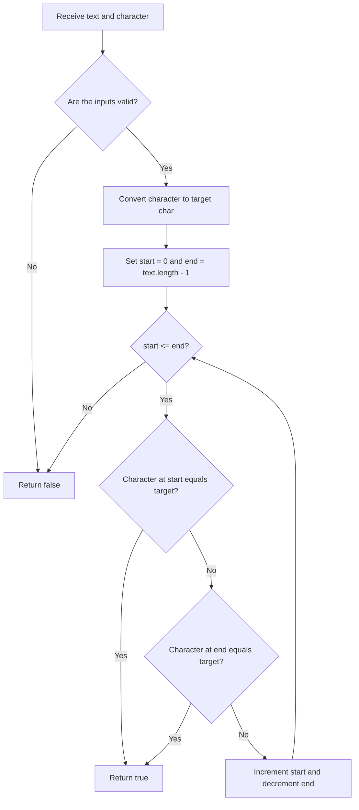

# Contains Character

String challenge from the [easy strings index](../README.md). The implementation is in
[ContainsChar.java](ContainsChar.java), including executable assertion-based examples.

<!-- TOC -->
* [Contains Character](#contains-character)
  * [Difficulty: 🟢 Easy](#difficulty--easy)
  * [Problem Description](#problem-description)
  * [Sample Input](#sample-input)
  * [Problem Analysis](#problem-analysis)
  * [Approach: Two-Pointer Search](#approach-two-pointer-search)
  * [Java Code with Step-by-Step Explanation](#java-code-with-step-by-step-explanation)
  * [How the Algorithm Works](#how-the-algorithm-works)
  * [Time/Space Complexity](#timespace-complexity)
  * [Edge Cases](#edge-cases)
  * [Diagram](#diagram)
<!-- TOC -->

## Difficulty: 🟢 Easy

**Category**: Strings

## Problem Description

Write a function that receives a string and a single character. The function must return `true` when the string contains
that character and `false` when it does not.

The method receives the character as a `String`, so the solution must first verify that it contains exactly one
character before starting the search.

**Requirements:**

- Return `true` when the character appears anywhere in the input string.
- Return `false` when the character is not present.
- Return `false` when `text` is `null`.
- Return `false` when `character` is `null`.
- Return `false` when `character` does not contain exactly one character.
- The comparison is case-sensitive.

## Sample Input

```java
containsChar("hola","o"); // true

containsChar("hola","z"); // false

containsChar("Java","J"); // true

containsChar("Java","j"); // false
```

## Problem Analysis

The goal is to determine whether a target character exists inside a string.

A basic solution can inspect every character from left to right. This implementation uses two pointers instead:

- `start` begins at the first character.
- `end` begins at the last character.
- Each loop checks both positions.
- After each iteration, `start` moves right and `end` moves left.
- The method returns immediately when either pointer finds the target.

This does not change the asymptotic time complexity, but it demonstrates the two-pointer technique and can reduce the
number of loop iterations because two positions are inspected during each iteration.

## Approach: Two-Pointer Search

1. **Validate the input**

   Before accessing either string, verify that:

    - `text` is not `null`.
    - `character` is not `null`.
    - `character.length()` is exactly `1`.

   Invalid input returns `false`.

2. **Convert the target to `char`**

   Because `text.charAt(...)` returns a primitive `char`, convert the one-character string with:

   ```java
   char target = character.charAt(0);
   ```

3. **Initialize two pointers**

   ```java
   int start = 0;
   int end = text.length() - 1;
   ```

4. **Search from both ends**

   Continue while `start <= end`:

    - Compare `text.charAt(start)` with `target`.
    - Compare `text.charAt(end)` with `target`.
    - Return `true` as soon as a match is found.
    - Otherwise, increment `start` and decrement `end`.

5. **Return `false` when no match exists**

   If the pointers cross without finding the target, the character is not present.

## Java Code with Step-by-Step Explanation

```java
public class Solution {
    public boolean containsChar(String text, String character) {
        // Step 1: Validate the input before using length() or charAt()
        if (text == null || character == null || character.length() != 1) {
            return false;
        }

        // Step 2: Convert the one-character String into a primitive char
        char target = character.charAt(0);

        // Step 3: Create one pointer for each end of the text
        int start = 0;
        int end = text.length() - 1;

        // Step 4: Continue until both pointers meet or cross
        while (start <= end) {
            // Check the character at the beginning side
            if (text.charAt(start) == target) {
                return true;
            }

            // Check the character at the ending side
            if (text.charAt(end) == target) {
                return true;
            }

            // Move both pointers toward the center
            start++;
            end--;
        }

        // Step 5: The target was not found
        return false;
    }
}
```

## How the Algorithm Works

Consider the following input:

```java
text ="coding"
character ="i"
```

The pointers move as follows:

| Iteration | `start` index | Start character | `end` index | End character | Result               |
|----------:|--------------:|:---------------:|------------:|:-------------:|:---------------------|
|         1 |             0 |       `c`       |           5 |      `g`      | No match             |
|         2 |             1 |       `o`       |           4 |      `n`      | No match             |
|         3 |             2 |       `d`       |           3 |      `i`      | Match found → `true` |

The method stops immediately after finding `i` at index `3`.

## Time/Space Complexity

- **Time Complexity**: **O (n)**, where `n` is the length of `text`. In the worst case, every character must be checked.
- **Space Complexity**: **O (1)**. The algorithm uses only a target character and two integer pointers.

Although the loop performs approximately `n / 2` iterations, it still checks up to `n` characters, so its time
complexity remains **O (n)**.

## Edge Cases

```java
containsChar(null,"a");    // false

containsChar("hello",null); // false

containsChar("hello","");   // false

containsChar("hello","he"); // false

containsChar("","a");       // false

containsChar("a","a");      // true

containsChar("Java","j");   // false: comparison is case-sensitive
```

## Diagram


