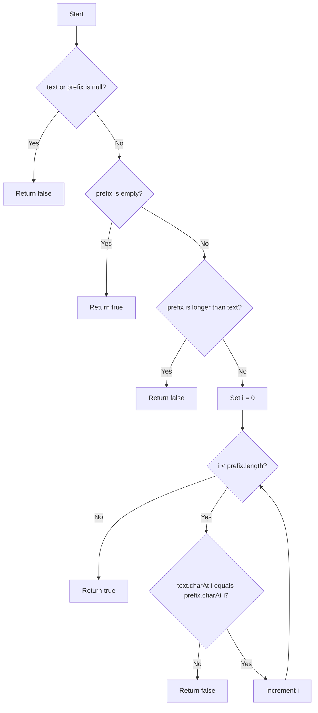

# Starts With Prefix

String challenge from the [easy strings index](../README.md). The implementation is in
[StartsWithPrefix.java](StartsWithPrefix.java), including executable assertion-based examples.

<!-- TOC -->
* [Starts With Prefix](#starts-with-prefix)
  * [Difficulty: 🟢 Easy](#difficulty--easy)
  * [Category](#category)
  * [Problem Description](#problem-description)
  * [Examples](#examples)
  * [Important Rules](#important-rules)
  * [Evaluation of the Original Solution](#evaluation-of-the-original-solution)
    * [What the solution does well](#what-the-solution-does-well)
    * [Problems in the original solution](#problems-in-the-original-solution)
      * [1. `trim()` changes the original string](#1-trim-changes-the-original-string)
      * [2. `trim()` can cause `StringIndexOutOfBoundsException`](#2-trim-can-cause-stringindexoutofboundsexception)
      * [3. Returning `true` for a `null` prefix is not logically correct](#3-returning-true-for-a-null-prefix-is-not-logically-correct)
      * [4. It creates unnecessary strings](#4-it-creates-unnecessary-strings)
  * [Recommended Approach: Direct Character Comparison](#recommended-approach-direct-character-comparison)
  * [Algorithm](#algorithm)
  * [Java Code](#java-code)
  * [Step-by-Step Explanation](#step-by-step-explanation)
  * [Execution Examples](#execution-examples)
    * [Example 1: Matching prefix](#example-1-matching-prefix)
    * [Example 2: Case mismatch](#example-2-case-mismatch)
    * [Example 3: Prefix longer than text](#example-3-prefix-longer-than-text)
    * [Example 4: Empty prefix](#example-4-empty-prefix)
    * [Example 5: Leading whitespace](#example-5-leading-whitespace)
  * [Time and Space Complexity](#time-and-space-complexity)
    * [Time Complexity](#time-complexity)
    * [Space Complexity](#space-complexity)
  * [Why This Approach Is Optimal](#why-this-approach-is-optimal)
  * [Alternative Using `regionMatches`](#alternative-using-regionmatches)
  * [Test Cases](#test-cases)
  * [Diagram](#diagram)
<!-- TOC -->

## Difficulty: 🟢 Easy

## Category

**Strings**

## Problem Description

Given two strings, `text` and `prefix`, implement a method that returns:

- `true` when `text` begins exactly with `prefix`.
- `false` otherwise.

The comparison is **case-sensitive**.

You must not use the native Java method:

```java
String.startsWith(...)
```

The method signature is:

```java
public boolean startsWith(String text, String prefix)
```

## Examples

```java
startsWith("hola mundo","hola");       // true

startsWith("hola mundo","Hola");       // false

startsWith("TypeScript","Type");        // true

startsWith("TypeScript","script");      // false

startsWith("","");                      // true

startsWith("abc","");                   // true
```

## Important Rules

1. An empty prefix is considered a valid prefix of every non-null string.

```java
startsWith("abc",""); // true

startsWith("","");    // true
```

2. When `prefix` is longer than `text`, the result must be `false`.

```java
startsWith("Java","JavaScript"); // false
```

3. Comparison is case-sensitive.

```java
startsWith("Java","java"); // false
```

4. Leading spaces are part of the string and must not be removed.

```java
startsWith(" hello"," "); // true

startsWith(" hello","h"); // false
```

## Evaluation of the Original Solution

The solution shown in the screenshot is approximately:

```java
public class Solution {
    public boolean startsWith(String text, String prefix) {
        if (prefix == null || prefix.isEmpty()) {
            return true;
        }

        if (prefix.length() > text.length()) {
            return false;
        }

        String start = text.trim().substring(0, prefix.length());

        return start.equals(prefix);
    }
}
```

### What the solution does well

The solution correctly identifies two important conditions:

```java
if(prefix.isEmpty()){
        return true;
        }
```

An empty string is a prefix of any string.

It also prevents a normal `substring` operation from being attempted when the prefix is longer than the original text:

```java
if(prefix.length() >text.

length()){
        return false;
        }
```

For many simple inputs, this solution returns the expected result.

### Problems in the original solution

#### 1. `trim()` changes the original string

This line is the main logical problem:

```java
String start = text.trim().substring(0, prefix.length());
```

The method must determine whether the **original** `text` begins with `prefix`.

Calling `trim()` removes leading and trailing whitespace before the comparison. This changes the input and can produce
an incorrect result.

Example:

```java
text =" hello"
prefix =" "
```

Expected result:

```java
true
```

The original text begins with a space.

However:

```java
text.trim()
```

produces:

```java
"hello"
```

The solution would therefore return `false`.

Another example:

```java
startsWith(" hello","hello");
```

The correct result is:

```java
false
```

The original string begins with a space, not with `h`.

The solution using `trim()` would incorrectly return:

```java
true
```

#### 2. `trim()` can cause `StringIndexOutOfBoundsException`

The length validation is made before trimming:

```java
if(prefix.length() >text.

length()){
        return false;
        }
```

But after `trim()`, the string can become shorter.

Example:

```java
text ="   "
prefix ="  "
```

Before trimming:

```java
text.length() ==3
        prefix.

length() ==2
```

Therefore, the length validation passes.

After trimming:

```java
text.trim().

length() ==0
```

The following operation is invalid:

```java
"".substring(0,2);
```

It throws:

```text
StringIndexOutOfBoundsException
```

#### 3. Returning `true` for a `null` prefix is not logically correct

The original condition is:

```java
if(prefix ==null||prefix.

isEmpty()){
        return true;
        }
```

An empty prefix and a `null` prefix are not the same thing.

- `""` is a valid string with length zero.
- `null` means that no string object exists.

Unless the challenge explicitly defines special behavior for `null`, returning `true` for a `null` prefix is misleading.

A safer defensive policy is:

```java
if(text ==null||prefix ==null){
        return false;
        }
```

This README uses that policy.

#### 4. It creates unnecessary strings

This expression creates intermediate string values:

```java
text.trim().

substring(0,prefix.length())
```

Conceptually, the method only needs to compare characters. It does not need to create a new string containing the
prefix-sized portion of `text`.

A direct character comparison avoids unnecessary allocations and uses constant auxiliary space.

## Recommended Approach: Direct Character Comparison

The most transparent solution is to compare each character of `prefix` with the character at the same position in
`text`.

For every index `i` from `0` to `prefix.length() - 1`, verify:

```java
text.charAt(i) ==prefix.

charAt(i)
```

If any pair of characters is different, return `false`.

If the loop finishes without finding a mismatch, return `true`.

## Algorithm

1. Check whether `text` or `prefix` is `null`.
    - If either is `null`, return `false`.

2. Check whether `prefix` is empty.
    - If it is empty, return `true`.

3. Compare the string lengths.
    - If `prefix.length()` is greater than `text.length()`, return `false`.

4. Iterate through every character in `prefix`.

5. Compare the character from `text` with the character from `prefix` at the same index.

6. If a mismatch is found, return `false` immediately.

7. If all characters match, return `true`.

## Java Code

```java
public class Solution {

    public boolean startsWith(String text, String prefix) {
        // Defensive validation:
        // a null reference is not treated as a valid string.
        if (text == null || prefix == null) {
            return false;
        }

        // The empty string is a prefix of every string.
        if (prefix.isEmpty()) {
            return true;
        }

        // A longer prefix cannot fit at the beginning of a shorter text.
        if (prefix.length() > text.length()) {
            return false;
        }

        // Compare only the characters that belong to the prefix.
        for (int i = 0; i < prefix.length(); i++) {
            if (text.charAt(i) != prefix.charAt(i)) {
                return false;
            }
        }

        // Every character in the prefix matched.
        return true;
    }
}
```

## Step-by-Step Explanation

Consider:

```java
text ="TypeScript"
prefix ="Type"
```

The algorithm compares the characters at the same indexes:

```text
Index:      0   1   2   3
Text:       T   y   p   e
Prefix:     T   y   p   e
Result:     ✓   ✓   ✓   ✓
```

Because every character in `prefix` matches the beginning of `text`, the method returns:

```java
true
```

Now consider:

```java
text ="TypeScript"
prefix ="type"
```

Comparison:

```text
Index:      0
Text:       T
Prefix:     t
Result:     ✗
```

Java character comparison is case-sensitive:

```java
'T'!='t'
```

The method immediately returns:

```java
false
```

This immediate return is called **early termination**. Once one mismatch is found, no additional comparisons are
necessary.

## Execution Examples

### Example 1: Matching prefix

```java
text ="hola mundo"
prefix ="hola"
```

```text
h == h
o == o
l == l
a == a
```

Result:

```java
true
```

### Example 2: Case mismatch

```java
text ="hola mundo"
prefix ="Hola"
```

First comparison:

```text
'h' != 'H'
```

Result:

```java
false
```

### Example 3: Prefix longer than text

```java
text ="Java"
prefix ="JavaScript"
```

```text
prefix.length() > text.length()
```

Result:

```java
false
```

No character comparisons are required.

### Example 4: Empty prefix

```java
text ="abc"
prefix =""
```

Result:

```java
true
```

The empty string can be found at the beginning of every string.

### Example 5: Leading whitespace

```java
text =" hello"
prefix =" "
```

The first character in both strings is a space.

Result:

```java
true
```

The algorithm does not call `trim()`, so it preserves the original input.

## Time and Space Complexity

Let:

```text
m = prefix.length()
```

### Time Complexity

```text
O(m)
```

In the worst case, the algorithm compares every character in `prefix`.

Examples of worst-case inputs:

```java
startsWith("abcdefgh","abcdefgh");

startsWith("abcdefgh","abcdefgz");
```

In the second example, the mismatch occurs at the final character.

The method may finish earlier when it finds a mismatch, but Big-O notation describes the worst case.

### Space Complexity

```text
O(1)
```

The algorithm uses only:

- An integer loop variable.
- Existing string references.
- Individual character comparisons.

It does not create an array, collection, trimmed string, or substring.

## Why This Approach Is Optimal

At minimum, a correct algorithm may need to inspect every character in `prefix`.

For example:

```java
text ="abcdefghij"
prefix ="abcdefghiX"
```

The algorithm cannot know that the prefix is invalid until it reaches the final character.

Therefore, the lower bound for the worst-case running time is:

```text
Ω(m)
```

The direct comparison algorithm runs in:

```text
O(m)
```

Since its upper and lower bounds match, its worst-case complexity is:

```text
Θ(m)
```

This makes the algorithm asymptotically optimal.

It also uses:

```text
O(1)
```

extra space, which is better than approaches that create a new substring or character array.

## Alternative Using `regionMatches`

Java also provides `regionMatches`, which compares a region of one string with a region of another string.

It does not call the prohibited `startsWith` method:

```java
public class Solution {

    public boolean startsWith(String text, String prefix) {
        if (text == null || prefix == null) {
            return false;
        }

        if (prefix.length() > text.length()) {
            return false;
        }

        return text.regionMatches(0, prefix, 0, prefix.length());
    }
}
```

The arguments mean:

```java
text.regionMatches(
    0,               // Start at index 0 in text
    prefix,          // Compare against prefix
    0,               // Start at index 0 in prefix
    prefix.length()  // Number of characters to compare
);
```

This version is concise and also runs in:

```text
Time:  O(m)
Space: O(1)
```

However, the manual loop is usually better for a coding challenge focused on understanding the algorithm because it
explicitly demonstrates how prefix comparison works.

## Test Cases

```java
public class Main {

    public static void main(String[] args) {
        Solution solution = new Solution();

        System.out.println(solution.startsWith("hola mundo", "hola"));
        // true

        System.out.println(solution.startsWith("hola mundo", "Hola"));
        // false

        System.out.println(solution.startsWith("TypeScript", "Type"));
        // true

        System.out.println(solution.startsWith("TypeScript", "script"));
        // false

        System.out.println(solution.startsWith("", ""));
        // true

        System.out.println(solution.startsWith("abc", ""));
        // true

        System.out.println(solution.startsWith("Java", "JavaScript"));
        // false

        System.out.println(solution.startsWith(" hello", " "));
        // true

        System.out.println(solution.startsWith(" hello", "hello"));
        // false

        System.out.println(solution.startsWith("   ", "  "));
        // true

        System.out.println(solution.startsWith(null, "abc"));
        // false

        System.out.println(solution.startsWith("abc", null));
        // false
    }
}
```

## Diagram


