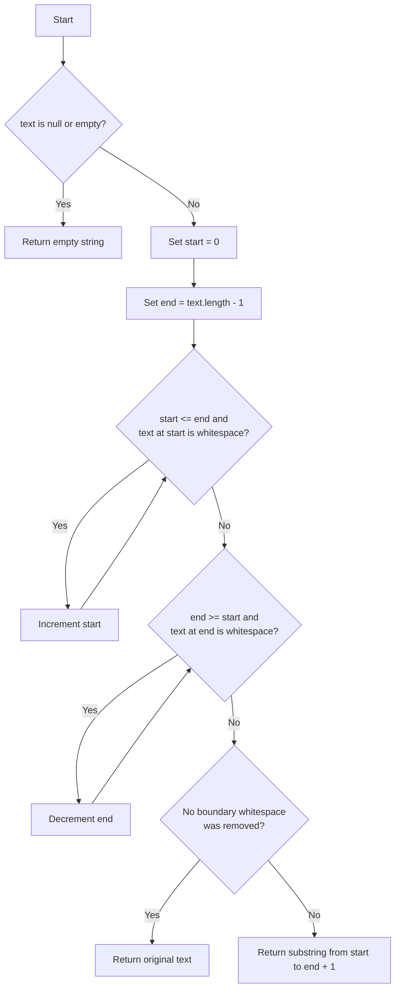

# Remove Leading and Trailing Whitespace

<!-- TOC -->
* [Remove Leading and Trailing Whitespace](#remove-leading-and-trailing-whitespace)
  * [Difficulty: 🟢 Easy](#difficulty--easy)
  * [Category](#category)
  * [Problem Description](#problem-description)
  * [Examples](#examples)
  * [Important Rules](#important-rules)
  * [Evaluation of the Submitted Solution](#evaluation-of-the-submitted-solution)
    * [What the solution does well](#what-the-solution-does-well)
    * [Possible improvements](#possible-improvements)
      * [1. Avoid creating a new string when no trimming is necessary](#1-avoid-creating-a-new-string-when-no-trimming-is-necessary)
      * [2. Be explicit about the `null` contract](#2-be-explicit-about-the-null-contract)
      * [3. The current approach is already asymptotically optimal](#3-the-current-approach-is-already-asymptotically-optimal)
  * [Recommended Approach: Two Boundary Pointers](#recommended-approach-two-boundary-pointers)
  * [Algorithm](#algorithm)
  * [Optimized Java Solution](#optimized-java-solution)
  * [Step-by-Step Explanation](#step-by-step-explanation)
    * [Step 1: Move `start`](#step-1-move-start)
    * [Step 2: Move `end`](#step-2-move-end)
    * [Step 3: Extract the valid range](#step-3-extract-the-valid-range)
  * [Execution Examples](#execution-examples)
    * [Example 1: Whitespace at both ends](#example-1-whitespace-at-both-ends)
    * [Example 2: No boundary whitespace](#example-2-no-boundary-whitespace)
    * [Example 3: Only whitespace](#example-3-only-whitespace)
    * [Example 4: Internal whitespace](#example-4-internal-whitespace)
    * [Example 5: Tabs and line breaks](#example-5-tabs-and-line-breaks)
  * [Correctness Explanation](#correctness-explanation)
    * [Property 1: Every character before `start` is whitespace](#property-1-every-character-before-start-is-whitespace)
    * [Property 2: Every character after `end` is whitespace](#property-2-every-character-after-end-is-whitespace)
    * [Property 3: Every character between `start` and `end` must remain](#property-3-every-character-between-start-and-end-must-remain)
  * [Time and Space Complexity](#time-and-space-complexity)
    * [Time Complexity](#time-complexity)
    * [Auxiliary Space Complexity](#auxiliary-space-complexity)
    * [Output Space](#output-space)
  * [Why This Approach Is Optimal](#why-this-approach-is-optimal)
  * [Alternative Solutions](#alternative-solutions)
    * [Alternative 1: Using `String.strip()`](#alternative-1-using-stringstrip)
    * [Alternative 2: Using `String.trim()`](#alternative-2-using-stringtrim)
    * [Alternative 3: Regular expression](#alternative-3-regular-expression)
  * [Test Cases](#test-cases)
  * [Running the Tests](#running-the-tests)
  * [Diagram](#diagram)
<!-- TOC -->

## Difficulty: 🟢 Easy

## Category

**Strings**

## Problem Description

Given a string, return a new string without whitespace at the beginning or at the end.

Whitespace inside the string must remain unchanged.

The expected method signature is:

```java
public String trim(String text)
```

The goal is to implement the behavior manually instead of using a built-in trimming method such as:

```java
text.trim();
text.

strip();
```

## Examples

```java
trim("  hola mundo  ");     // "hola mundo"

trim("   typescript   ");    // "typescript"

trim("sin espacios");        // "sin espacios"

trim("   ");                 // ""

trim("");                    // ""
```

Internal whitespace must be preserved:

```java
trim("  hola   mundo  ");    // "hola   mundo"
```

Only the whitespace at the boundaries is removed.

## Important Rules

1. Remove whitespace only from the beginning of the string.

2. Remove whitespace only from the end of the string.

3. Preserve all characters and whitespace between the first and last non-whitespace characters.

4. An empty string must return an empty string.

5. A string containing only whitespace must return an empty string.

6. The submitted solution also treats `null` as an empty string:

```java
trim(null); // ""
```

This is a defensive decision rather than a universal Java convention.

## Evaluation of the Submitted Solution

The solution shown in the screenshot is:

```java
public class RemoveWhitespace {
    public String trim(String text) {
        if (text == null || text.isEmpty()) {
            return "";
        }

        int start = 0;
        int end = text.length() - 1;

        while (
                start <= end
                        && Character.isWhitespace(text.charAt(start))
        ) {
            start++;
        }

        while (
                end >= start
                        && Character.isWhitespace(text.charAt(end))
        ) {
            end--;
        }

        return text.substring(start, end + 1);
    }
}
```

### What the solution does well

The submitted solution is logically correct for the challenge.

It uses two boundary indexes:

```java
int start = 0;
int end = text.length() - 1;
```

The `start` index moves from left to right until it reaches the first non-whitespace character:

```java
while(
start <=end
        &&Character.

isWhitespace(text.charAt(start))
        ){
start++;
        }
```

The `end` index moves from right to left until it reaches the last non-whitespace character:

```java
while(
end >=start
        &&Character.

isWhitespace(text.charAt(end))
        ){
end--;
        }
```

Finally, the method returns only the section between those two indexes:

```java
return text.substring(start, end +1);
```

The use of:

```java
end +1
```

is necessary because the second argument of `substring` is exclusive.

For example:

```java
text.substring(2,6);
```

returns characters at indexes:

```text
2, 3, 4, and 5
```

but not index `6`.

The solution also correctly handles strings containing only whitespace.

Example:

```java
text ="   "
```

After the first loop:

```text
start = 3
end   = 2
```

The result is:

```java
text.substring(3,3);
```

which is:

```java
""
```

There is no exception because `substring(3, 3)` is a valid empty range.

### Possible improvements

#### 1. Avoid creating a new string when no trimming is necessary

For this input:

```java
text ="hello"
```

the submitted solution eventually calls:

```java
text.substring(0,text.length());
```

The method can explicitly return the original reference when no whitespace was removed:

```java
if(start ==0&&end ==text.

length() -1){
        return text;
}
```

This avoids unnecessary work and clearly communicates that the original string is already valid.

#### 2. Be explicit about the `null` contract

The submitted solution returns an empty string for `null`:

```java
if(text ==null){
        return"";
        }
```

This may be acceptable for the challenge, but it converts two different states into the same result:

```text
null  -> ""
""    -> ""
```

In production code, other reasonable contracts include:

```java
return null;
```

or:

```java
Objects.requireNonNull(text, "text cannot be null");
```

For this README, the optimized solution preserves the behavior from the screenshot and returns `""` for `null`.

#### 3. The current approach is already asymptotically optimal

There is no algorithm with a better worst-case time complexity for this problem.

To know where the meaningful content begins and ends, the algorithm may need to inspect every character.

The main improvement is therefore not a different asymptotic algorithm, but a small allocation optimization.

## Recommended Approach: Two Boundary Pointers

Use one index for the left boundary and another index for the right boundary.

```text
start -> searches for the first non-whitespace character
end   -> searches for the last non-whitespace character
```

This is often described as a **two-pointer technique**, although the pointers move independently from opposite ends.

Example:

```text
Input:  "   hello world   "
         ^               ^
       start            end
```

Move `start` to the right:

```text
Input:  "   hello world   "
            ^
          start
```

Move `end` to the left:

```text
Input:  "   hello world   "
                        ^
                       end
```

Return the range:

```text
"hello world"
```

## Algorithm

1. If `text` is `null` or empty, return `""`.

2. Set:

```java
start =0;
end =text.

length() -1;
```

3. Move `start` to the right while:

```java
Character.isWhitespace(text.charAt(start))
```

is `true`.

4. Move `end` to the left while:

```java
Character.isWhitespace(text.charAt(end))
```

is `true`.

5. If no whitespace was removed, return the original string.

6. Otherwise, return:

```java
text.substring(start, end +1);
```

## Optimized Java Solution

```java
public class RemoveWhitespace {

    public String trim(String text) {
        // Preserve the behavior expected by this challenge:
        // null and empty input both produce an empty string.
        if (text == null || text.isEmpty()) {
            return "";
        }

        int start = 0;
        int end = text.length() - 1;

        // Find the first non-whitespace character.
        while (
                start <= end
                        && Character.isWhitespace(text.charAt(start))
        ) {
            start++;
        }

        // Find the last non-whitespace character.
        while (
                end >= start
                        && Character.isWhitespace(text.charAt(end))
        ) {
            end--;
        }

        // If the original string has no boundary whitespace,
        // return the same string instead of creating another one.
        if (start == 0 && end == text.length() - 1) {
            return text;
        }

        // substring uses an exclusive ending index.
        return text.substring(start, end + 1);
    }
}
```

## Step-by-Step Explanation

Consider:

```java
text ="   hello world   "
```

The indexes initially are:

```text
Index:  0 1 2 3 4 5 6 7 8 9 10 11 12 13 14 15 16
Text:   · · · h e l l o · w  o  r  l  d  ·  ·  ·
        ^                                               ^
      start                                            end
```

Here, `·` represents a space.

### Step 1: Move `start`

The first three characters are whitespace:

```text
Index 0 -> whitespace
Index 1 -> whitespace
Index 2 -> whitespace
Index 3 -> 'h'
```

The loop stops at:

```java
start =3;
```

### Step 2: Move `end`

The last three characters are whitespace:

```text
Index 16 -> whitespace
Index 15 -> whitespace
Index 14 -> whitespace
Index 13 -> 'd'
```

The loop stops at:

```java
end =13;
```

### Step 3: Extract the valid range

The method executes:

```java
text.substring(3,14);
```

The ending index is `14` because `substring` excludes that position.

Result:

```java
"hello world"
```

## Execution Examples

### Example 1: Whitespace at both ends

```java
text ="  hola mundo  "
```

After scanning:

```text
start = 2
end   = 11
```

Result:

```java
"hola mundo"
```

### Example 2: No boundary whitespace

```java
text ="sin espacios"
```

After scanning:

```text
start = 0
end   = text.length() - 1
```

The optimized implementation returns the original string:

```java
return text;
```

Result:

```java
"sin espacios"
```

### Example 3: Only whitespace

```java
text ="    "
```

The left scan reaches the end:

```text
start = 4
end   = 3
```

The method returns:

```java
text.substring(4,4);
```

Result:

```java
""
```

### Example 4: Internal whitespace

```java
text ="  one   two  "
```

Only the boundary whitespace is removed.

Result:

```java
"one   two"
```

The three spaces between `one` and `two` remain unchanged.

### Example 5: Tabs and line breaks

```java
text ="\t\nJava\r\n"
```

`Character.isWhitespace` recognizes the boundary tab and line-break characters.

Result:

```java
"Java"
```

## Correctness Explanation

We can explain why the algorithm is correct using three properties.

### Property 1: Every character before `start` is whitespace

The first loop increments `start` only while the current character is whitespace.

When the loop ends, one of two conditions is true:

```text
start > end
```

or:

```text
text.charAt(start) is not whitespace
```

Therefore, every character before `start` is boundary whitespace and can be safely removed.

### Property 2: Every character after `end` is whitespace

The second loop decrements `end` only while the current character is whitespace.

When the loop ends, one of two conditions is true:

```text
end < start
```

or:

```text
text.charAt(end) is not whitespace
```

Therefore, every character after `end` is boundary whitespace and can be safely removed.

### Property 3: Every character between `start` and `end` must remain

The algorithm does not modify or inspect internal whitespace for removal.

It returns the entire continuous range:

```java
text.substring(start, end +1);
```

Therefore:

- All leading whitespace is excluded.
- All trailing whitespace is excluded.
- All internal characters remain in their original order.

This proves that the returned string is exactly the original string without leading or trailing whitespace.

## Time and Space Complexity

Let:

```text
n = text.length()
```

### Time Complexity

```text
O(n)
```

The left loop examines characters from the beginning.

The right loop examines characters from the end.

Although there are two loops, the total work is still linear:

```text
O(n) + O(n) = O(n)
```

Examples of worst-case inputs:

```java
"          "
        "          hello"
        "hello          "
```

### Auxiliary Space Complexity

```text
O(1)
```

The algorithm uses only:

```java
int start;
int end;
```

No array, list, set, or other data structure grows with the input.

### Output Space

The returned trimmed string can contain up to `n` characters:

```text
O(n)
```

When complexity analysis excludes the required output, the auxiliary space remains:

```text
O(1)
```

## Why This Approach Is Optimal

In the worst case, the algorithm must inspect every character.

Consider:

```java
text ="                    "
```

The method cannot know that the string contains only whitespace without examining all characters.

Therefore, any correct algorithm has a worst-case lower bound of:

```text
Ω(n)
```

The two-boundary-pointer solution runs in:

```text
O(n)
```

Because the lower and upper bounds match, its worst-case running time is:

```text
Θ(n)
```

The algorithm also uses constant auxiliary memory:

```text
O(1)
```

Therefore, it is asymptotically optimal for this problem.

## Alternative Solutions

### Alternative 1: Using `String.strip()`

Java 11 and later provide:

```java
public String trim(String text) {
    if (text == null) {
        return "";
    }

    return text.strip();
}
```

This is concise and Unicode-aware.

However, it may violate the purpose or restrictions of the coding challenge because it delegates the complete operation
to a built-in method.

### Alternative 2: Using `String.trim()`

```java
public String trim(String text) {
    if (text == null) {
        return "";
    }

    return text.trim();
}
```

This is also concise, but Java's historical `trim()` behavior is based on characters whose code point is less than or
equal to `U+0020`.

By contrast:

```java
Character.isWhitespace(...)
```

and:

```java
String.strip()
```

recognize a broader set of whitespace characters.

For algorithm practice, the manual two-pointer implementation is more instructive.

### Alternative 3: Regular expression

```java
public String trim(String text) {
    if (text == null) {
        return "";
    }

    return text.replaceAll("^\\s+|\\s+$", "");
}
```

This solution is not recommended for this challenge.

Reasons:

- It is less explicit.
- It uses a regular-expression engine.
- It can be slower than a direct scan.
- It hides the fundamental boundary-search algorithm.
- It creates additional processing overhead.

## Test Cases

The tests are implemented in `RemoveWhitespace.java` itself. They cover:

- whitespace at both boundaries;
- empty, `null`, and whitespace-only input;
- preservation of internal whitespace;
- spaces, tabs, newlines, carriage returns, vertical tabs, and Unicode em spaces;
- strings that do not need trimming, including returning the original reference.

The test runner is the class's `main` method:

```java
public static void main(String[] args) {
    RemoveWhitespace removeWhitespace = new RemoveWhitespace();

    testWhitespaceAtBothEnds(removeWhitespace);
    testNoBoundaryWhitespace(removeWhitespace);
    testWhitespaceOnlyAndEmptyInput(removeWhitespace);
    testInternalWhitespaceIsPreserved(removeWhitespace);
    testDifferentWhitespaceCharacters(removeWhitespace);
    testNullInput(removeWhitespace);
}
```

Each test throws `AssertionError` if it fails. A successful run prints:

```text
All RemoveWhitespace tests passed.
```

## Running the Tests

From the repository root, compile and run the class with:

```bash
BUILD_DIR=$(mktemp -d /tmp/remove-whitespace-build.XXXXXX)
javac -d "$BUILD_DIR" \
  src/coding_challenges/strings/easy/_03_remove_whitespace/RemoveWhitespace.java
java -cp "$BUILD_DIR" \
  coding_challenges.strings.easy._03_remove_whitespace.RemoveWhitespace
```

## Diagram


