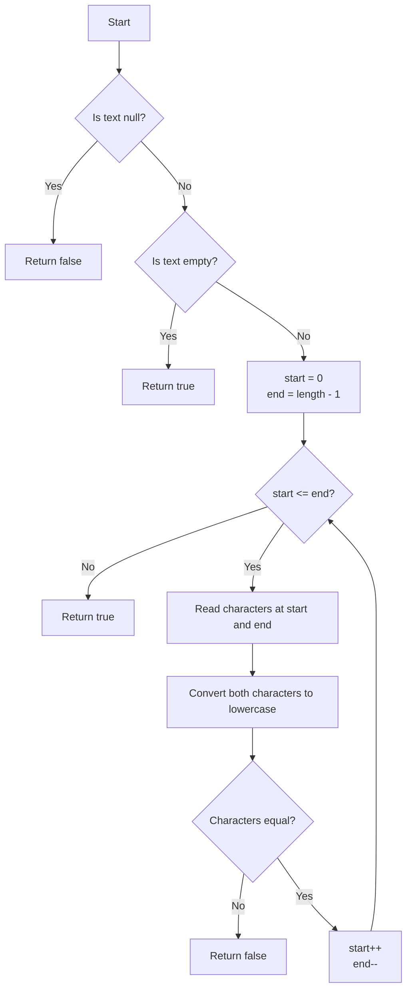

# Palindrome Check

String challenge from the [easy strings index](../README.md). The implementation and executable assertion-based tests are in
[Palindrome.java](Palindrome.java).

<!-- TOC -->
* [Palindrome Check](#palindrome-check)
  * [Difficulty: 🟢 Easy](#difficulty--easy)
  * [Category](#category)
  * [Problem Description](#problem-description)
  * [Examples](#examples)
    * [Example 1](#example-1)
    * [Example 2](#example-2)
    * [Example 3](#example-3)
    * [Example 4](#example-4)
    * [Example 5](#example-5)
  * [Important Rules](#important-rules)
  * [Problem Analysis](#problem-analysis)
  * [Approach: Two Pointers](#approach-two-pointers)
  * [Algorithm](#algorithm)
  * [Final Java Solution](#final-java-solution)
  * [Step-by-Step Explanation](#step-by-step-explanation)
    * [Null validation](#null-validation)
    * [Empty string validation](#empty-string-validation)
    * [Initialize the pointers](#initialize-the-pointers)
    * [Compare mirrored characters](#compare-mirrored-characters)
    * [Early return on mismatch](#early-return-on-mismatch)
    * [Move the pointers](#move-the-pointers)
    * [Complete the loop](#complete-the-loop)
    * [Return true](#return-true)
  * [Execution Walkthrough](#execution-walkthrough)
    * [Iteration 1](#iteration-1)
    * [Iteration 2](#iteration-2)
    * [Iteration 3](#iteration-3)
  * [Why Two Pointers Work Well Here](#why-two-pointers-work-well-here)
  * [Evaluation of the Final Solution](#evaluation-of-the-final-solution)
    * [Strengths](#strengths)
      * [Correct handling of null](#correct-handling-of-null)
      * [Correct handling of the empty string](#correct-handling-of-the-empty-string)
      * [Correct Two Pointers implementation](#correct-two-pointers-implementation)
      * [Good use of early return](#good-use-of-early-return)
      * [No unnecessary lowercase copy](#no-unnecessary-lowercase-copy)
      * [Clear pointer movement](#clear-pointer-movement)
    * [Minor improvements](#minor-improvements)
      * [`isEmpty()` can improve readability](#isempty-can-improve-readability)
      * [`start < end` is sufficient](#start--end-is-sufficient)
      * [Clarify the problem contract in interviews](#clarify-the-problem-contract-in-interviews)
  * [Correctness Explanation](#correctness-explanation)
    * [Case 1: The characters differ](#case-1-the-characters-differ)
    * [Case 2: The characters match](#case-2-the-characters-match)
    * [Loop completion](#loop-completion)
  * [Time and Space Complexity](#time-and-space-complexity)
    * [Time Complexity](#time-complexity)
    * [Auxiliary Space Complexity](#auxiliary-space-complexity)
  * [Edge Cases](#edge-cases)
    * [Null input](#null-input)
    * [Empty string](#empty-string)
    * [One character](#one-character)
    * [Two equal characters](#two-equal-characters)
    * [Two different characters](#two-different-characters)
    * [Odd-length palindrome](#odd-length-palindrome)
    * [Even-length palindrome](#even-length-palindrome)
    * [Case-insensitive palindrome](#case-insensitive-palindrome)
    * [Non-palindrome](#non-palindrome)
    * [Spaces are considered characters](#spaces-are-considered-characters)
    * [Punctuation is considered](#punctuation-is-considered)
  * [Test Cases](#test-cases)
  * [Interview Takeaways](#interview-takeaways)
    * [1. Recognize the pattern before coding](#1-recognize-the-pattern-before-coding)
    * [2. Define what each pointer means](#2-define-what-each-pointer-means)
    * [3. Identify the failure condition](#3-identify-the-failure-condition)
    * [4. Clarify requirements before implementation](#4-clarify-requirements-before-implementation)
    * [5. Think about complexity](#5-think-about-complexity)
    * [6. Learn the transferable idea](#6-learn-the-transferable-idea)
  * [Diagram](#diagram)
<!-- TOC -->

## Difficulty: 🟢 Easy

## Category

**Strings / Two Pointers**

## Problem Description

Given a string, determine whether it is a palindrome.

A palindrome is a sequence that reads the same from left to right and from right to left.

The comparison in this implementation is **case-insensitive**.

Examples:

```text
"radar" -> true
"Radar" -> true
"level" -> true
"hello" -> false
```

The expected method signature is:

```java
public boolean isPalindrome(String text)
```

The submitted implementation also defines the following behavior:

```text
null -> false
""   -> true
```

## Examples

### Example 1

Input:

```java
"radar"
```

Result:

```java
true
```

Explanation:

```text
r == r
a == a
d == d
```

All mirrored characters match.

### Example 2

Input:

```java
"Radar"
```

Result:

```java
true
```

The comparison ignores letter casing.

Conceptually:

```text
R -> r
r -> r
```

The string is therefore treated as:

```text
radar
```

### Example 3

Input:

```java
"hello"
```

Result:

```java
false
```

The first and last characters differ:

```text
h != o
```

The method can immediately return `false`.

### Example 4

Input:

```java
""
```

Result:

```java
true
```

An empty string is considered a palindrome because there are no mismatching character pairs.

### Example 5

Input:

```java
null
```

Result:

```java
false
```

This is the contract chosen by the implementation.

## Important Rules

1. Compare characters from both ends of the string.
2. The comparison is case-insensitive.
3. Do not create a reversed copy of the string.
4. Return `false` immediately when a mismatching pair is found.
5. Return `false` for `null`.
6. Return `true` for an empty string.
7. Spaces and punctuation are **not ignored** by this implementation.
8. The method uses constant auxiliary space.

For example:

```java
"A man, a plan, a canal: Panama"
```

would return:

```java
false
```

because spaces and punctuation are compared as regular characters.

If the problem statement required ignoring non-alphanumeric characters, the algorithm would need additional logic.

## Problem Analysis

A straightforward way to check whether a string is a palindrome would be to reverse the string and compare the reversed version with the original.

Conceptually:

```text
original == reversed
```

However, that approach requires creating another representation of the string.

Instead, notice the defining property of a palindrome:

```text
first character  == last character
second character == second-to-last character
third character  == third-to-last character
...
```

This naturally suggests using two indexes:

```text
start -> beginning of the string
end   -> end of the string
```

For example:

```text
r a d a r
^       ^
start   end
```

After comparing the first pair:

```text
r a d a r
  ^   ^
start end
```

The pointers continue moving toward the center.

If any pair differs, the string cannot be a palindrome and the method can return immediately.

This is the **Two Pointers** pattern.

## Approach: Two Pointers

Initialize:

```java
int start = 0;
int end = text.length() - 1;
```

Then repeatedly compare:

```java
text.charAt(start)
```

with:

```java
text.charAt(end)
```

Because the comparison must be case-insensitive, convert each character at comparison time:

```java
Character.toLowerCase(text.charAt(start))
```

and:

```java
Character.toLowerCase(text.charAt(end))
```

If they are different:

```java
return false;
```

Otherwise:

```java
start++;
end--;
```

The pointers move toward the center until all mirrored pairs have been validated.

## Algorithm

1. If `text` is `null`, return `false`.
2. If the string is empty, return `true`.
3. Initialize `start` at index `0`.
4. Initialize `end` at index `text.length() - 1`.
5. While `start <= end`:
    - Convert both current characters to lowercase.
    - Compare them.
    - If they are different, return `false`.
    - Move `start` one position to the right.
    - Move `end` one position to the left.
6. If the loop completes without finding a mismatch, return `true`.

Pseudocode:

```text
function isPalindrome(text):

    if text is null:
        return false

    if text is empty:
        return true

    start = 0
    end = text.length - 1

    while start <= end:

        leftCharacter = lowercase(text[start])
        rightCharacter = lowercase(text[end])

        if leftCharacter != rightCharacter:
            return false

        start++
        end--

    return true
```

## Final Java Solution

```java
public class Solution {

    public boolean isPalindrome(String text) {

        if (text == null) {
            return false;
        }

        if (text.length() == 0) {
            return true;
        }

        int start = 0;
        int end = text.length() - 1;

        while (start <= end) {
            if (
                Character.toLowerCase(text.charAt(start))
                    != Character.toLowerCase(text.charAt(end))
            ) {
                return false;
            }

            start++;
            end--;
        }

        return true;
    }
}
```

## Step-by-Step Explanation

### Null validation

```java
if (text == null) {
    return false;
}
```

This prevents the method from later calling methods such as `text.length()` or `text.charAt(...)` on a `null` reference.

Without this validation, the method could throw a `NullPointerException`.

The implementation explicitly defines `null` as not being a palindrome.

### Empty string validation

```java
if (text.length() == 0) {
    return true;
}
```

An empty string contains no mismatching characters, so it is considered a palindrome.

This could also be written as:

```java
if (text.isEmpty()) {
    return true;
}
```

Both versions are correct.

### Initialize the pointers

```java
int start = 0;
int end = text.length() - 1;
```

Java strings use zero-based indexing.

For:

```text
"radar"
```

the indexes are:

```text
r a d a r
0 1 2 3 4
```

Therefore:

```text
start = 0
end   = 4
```

### Compare mirrored characters

```java
if (
    Character.toLowerCase(text.charAt(start))
        != Character.toLowerCase(text.charAt(end))
) {
    return false;
}
```

The characters are converted individually to lowercase.

This avoids creating an additional lowercase copy of the entire string.

For example, with `"Radar"`:

```text
'R' -> 'r'
'r' -> 'r'
```

The first mirrored pair matches.

### Early return on mismatch

```java
return false;
```

As soon as one mirrored pair differs, there is no need to continue checking the remaining characters.

For example:

```text
"hello"
```

First comparison:

```text
h != o
```

The result is already known.

### Move the pointers

```java
start++;
end--;
```

After a successful comparison, both pointers move toward the center.

For:

```text
r a d a r
^       ^
```

they become:

```text
r a d a r
  ^   ^
```

### Complete the loop

```java
while (start <= end)
```

The loop continues until the pointers meet or cross.

For odd-length strings such as `"radar"`, the center character is eventually compared with itself.

This is valid, although using:

```java
while (start < end)
```

would also be correct because a middle character can never invalidate a palindrome.

### Return true

```java
return true;
```

If no mismatching pair was found, every required mirrored pair matched.

Therefore, the string is a palindrome.

## Execution Walkthrough

Consider:

```java
text = "Radar"
```

Indexes:

```text
R a d a r
0 1 2 3 4
```

Initial state:

```text
start = 0
end   = 4
```

### Iteration 1

Characters:

```text
text.charAt(0) = 'R'
text.charAt(4) = 'r'
```

Lowercase comparison:

```text
'r' == 'r'
```

Move pointers:

```text
start = 1
end   = 3
```

### Iteration 2

Characters:

```text
'a' == 'a'
```

Move pointers:

```text
start = 2
end   = 2
```

### Iteration 3

Characters:

```text
'd' == 'd'
```

Move pointers:

```text
start = 3
end   = 1
```

Now:

```text
start > end
```

The loop ends.

Final result:

```java
true
```

## Why Two Pointers Work Well Here

The Two Pointers pattern is useful when a problem involves relationships between positions on opposite sides of a sequence.

A palindrome has a symmetric structure:

```text
index 0 <-> index n - 1
index 1 <-> index n - 2
index 2 <-> index n - 3
...
```

Two pointers represent these mirrored positions directly.

The important invariant is:

```text
All characters outside the current [start, end] range
have already been verified as matching mirrored pairs.
```

At every iteration:

1. Compare the current mirrored pair.
2. If the pair differs, the palindrome property is broken.
3. If the pair matches, shrink the unchecked range.

This pattern also appears in many other interview problems, including:

- Reversing arrays.
- Two Sum on sorted arrays.
- Removing duplicates.
- Partitioning sequences.
- Comparing values from both ends.

The important lesson is not to memorize the palindrome solution, but to recognize when a problem contains **symmetry or two ends moving toward each other**.

## Evaluation of the Final Solution

The final solution is correct for the defined problem.

### Strengths

#### Correct handling of null

```java
if (text == null) {
    return false;
}
```

This prevents a `NullPointerException`.

#### Correct handling of the empty string

```java
if (text.length() == 0) {
    return true;
}
```

The method explicitly handles this edge case.

#### Correct Two Pointers implementation

```java
int start = 0;
int end = text.length() - 1;
```

The algorithm compares mirrored positions without creating a reversed string.

#### Good use of early return

```java
if (...) {
    return false;
}
```

The method stops immediately when the result is already known.

#### No unnecessary lowercase copy

Instead of:

```java
String textLower = text.toLowerCase();
```

the final implementation uses:

```java
Character.toLowerCase(...)
```

for each compared character.

This avoids allocating another string proportional to the input size.

#### Clear pointer movement

```java
start++;
end--;
```

The direction of both pointers directly reflects the palindrome comparison strategy.

### Minor improvements

#### `isEmpty()` can improve readability

Instead of:

```java
if (text.length() == 0)
```

you could write:

```java
if (text.isEmpty())
```

This is not a performance improvement. It is only slightly more expressive.

#### `start < end` is sufficient

The current condition:

```java
while (start <= end)
```

is correct.

However:

```java
while (start < end)
```

is also sufficient.

When `start == end`, both pointers refer to the middle character of an odd-length string, and comparing that character with itself cannot invalidate the palindrome.

The submitted `<=` version is fully correct.

#### Clarify the problem contract in interviews

The implementation treats spaces and punctuation as normal characters.

Therefore:

```java
isPalindrome("A man, a plan, a canal: Panama")
```

returns:

```java
false
```

Before solving an interview problem, clarify requirements such as:

```text
Should the comparison ignore case?
Should spaces be ignored?
Should punctuation be ignored?
Should only letters and digits be considered?
How should null be handled?
```

These questions can materially change the implementation.

## Correctness Explanation

Assume the string is not `null`.

The algorithm maintains two pointers, `start` and `end`, that represent mirrored positions in the string.

### Case 1: The characters differ

If:

```java
Character.toLowerCase(text.charAt(start))
    != Character.toLowerCase(text.charAt(end))
```

then at least one required mirrored pair does not match.

A palindrome requires every mirrored pair to be equal.

Therefore, returning `false` is correct.

### Case 2: The characters match

If the characters are equal, that mirrored pair satisfies the palindrome condition.

The pointers then move inward:

```java
start++;
end--;
```

The algorithm repeats the same validation for the next mirrored pair.

### Loop completion

If the pointers meet or cross without finding a mismatch, every mirrored character pair has matched.

Therefore, the entire string satisfies the palindrome definition and returning `true` is correct.

## Time and Space Complexity

Let:

```text
n = number of characters in the string
```

### Time Complexity

```text
O(n)
```

The pointers move toward each other.

At most approximately `n / 2` character pairs are checked.

In Big-O notation:

```text
O(n / 2) -> O(n)
```

Constant factors are ignored.

### Auxiliary Space Complexity

```text
O(1)
```

The method uses only pointer variables and temporary character values.

It does not create another string or array proportional to the input size.

## Edge Cases

### Null input

```java
isPalindrome(null);
```

Result:

```java
false
```

### Empty string

```java
isPalindrome("");
```

Result:

```java
true
```

### One character

```java
isPalindrome("a");
```

Result:

```java
true
```

### Two equal characters

```java
isPalindrome("aa");
```

Result:

```java
true
```

### Two different characters

```java
isPalindrome("ab");
```

Result:

```java
false
```

### Odd-length palindrome

```java
isPalindrome("radar");
```

Result:

```java
true
```

### Even-length palindrome

```java
isPalindrome("abba");
```

Result:

```java
true
```

### Case-insensitive palindrome

```java
isPalindrome("Radar");
```

Result:

```java
true
```

### Non-palindrome

```java
isPalindrome("coding");
```

Result:

```java
false
```

### Spaces are considered characters

```java
isPalindrome("nurses run");
```

Result:

```java
false
```

### Punctuation is considered

```java
isPalindrome("A man, a plan, a canal: Panama");
```

Result:

```java
false
```

## Test Cases

`Palindrome.java` includes executable assertion-based tests covering:

- odd- and even-length palindromes;
- single-character, empty, and `null` inputs;
- non-palindromes and early mismatches;
- case-insensitive comparisons; and
- spaces and punctuation, which are treated as ordinary characters.

Run them from the repository root with:

```bash
javac -d /tmp/code-challenges-classes src/coding_challenges/strings/easy/_04_is_palindrome/Palindrome.java
java -cp /tmp/code-challenges-classes coding_challenges.strings.easy._04_is_palindrome.Palindrome
```

Expected output:

```text
All Palindrome tests passed.
```

## Interview Takeaways

### 1. Recognize the pattern before coding

A palindrome is symmetric.

Whenever a problem asks you to compare values from opposite ends of an array or string, consider:

```text
Two Pointers
```

### 2. Define what each pointer means

Before writing the loop:

```text
start = next unchecked character from the left
end   = next unchecked character from the right
```

A precise definition makes pointer updates easier to reason about.

### 3. Identify the failure condition

Instead of thinking:

```text
How do I prove this is a palindrome?
```

it is often easier to ask:

```text
What would prove that it is NOT a palindrome?
```

The answer is:

```text
one mismatching mirrored pair
```

That gives the simple early-return condition:

```java
if (left != right) {
    return false;
}
```

### 4. Clarify requirements before implementation

Important interview questions include:

```text
Is the comparison case-sensitive?
Should spaces be ignored?
Should punctuation be ignored?
Should only alphanumeric characters be considered?
What should happen for null?
Is an empty string considered a palindrome?
```

Do not silently assume these requirements.

### 5. Think about complexity

A reversed-string solution may also run in `O(n)` time, but it generally requires `O(n)` additional memory.

The Two Pointers solution achieves:

```text
Time:  O(n)
Space: O(1)
```

which is a strong interview solution.

### 6. Learn the transferable idea

The main lesson from this challenge is not:

```text
To solve palindrome, use this exact code.
```

The reusable idea is:

```text
When a sequence has a relationship between both ends,
consider placing one pointer at each end and moving them inward.
```

That reasoning transfers to many other array and string problems.

## Diagram


